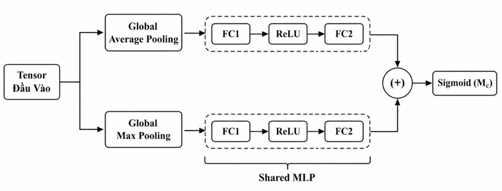
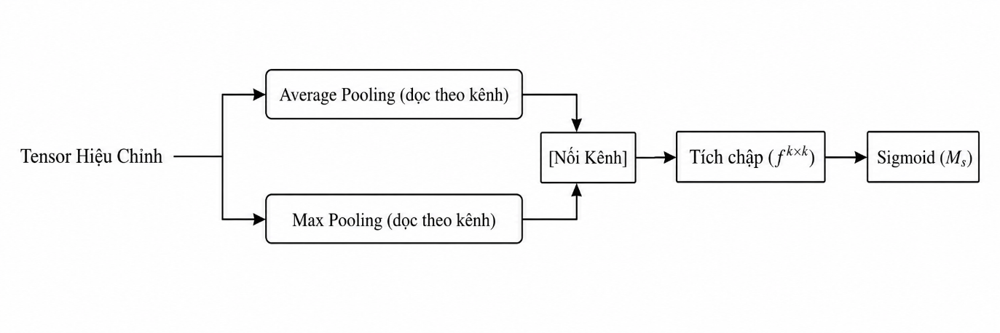
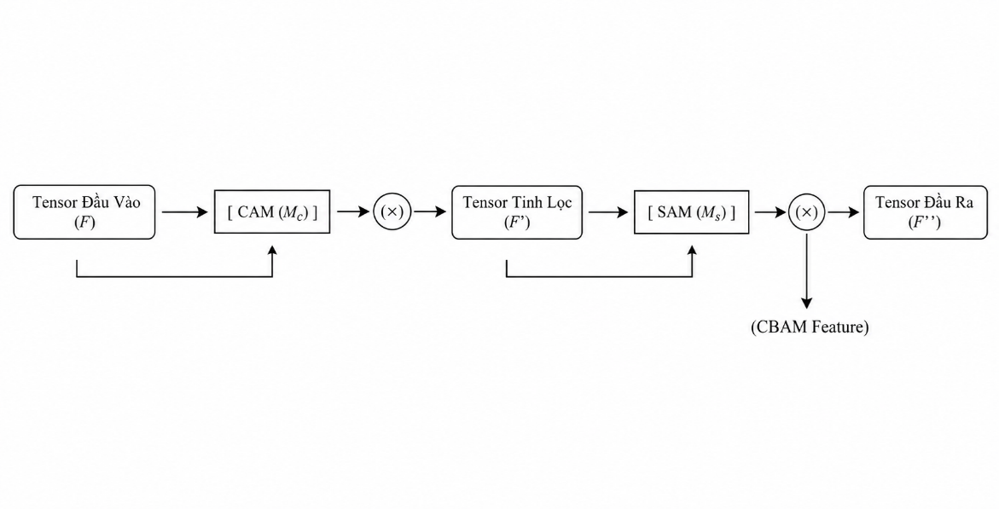
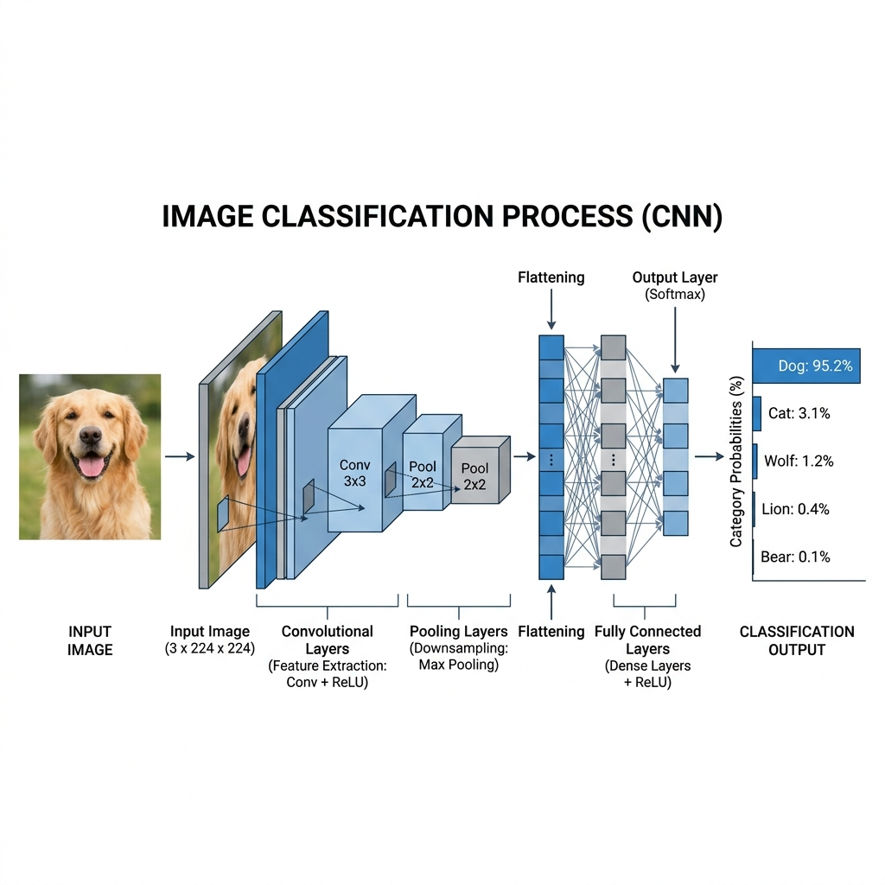
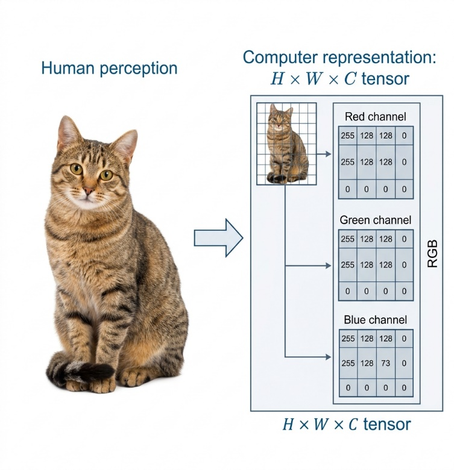
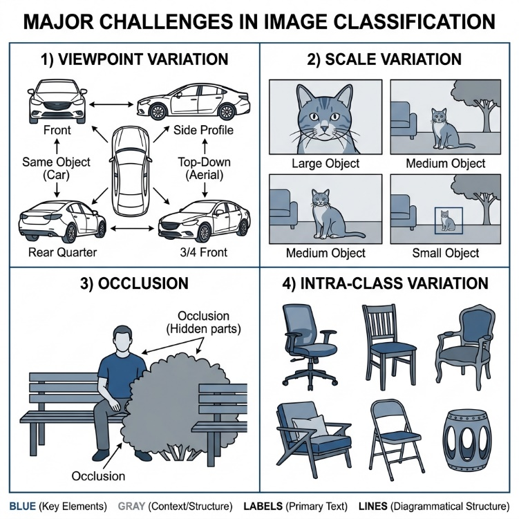
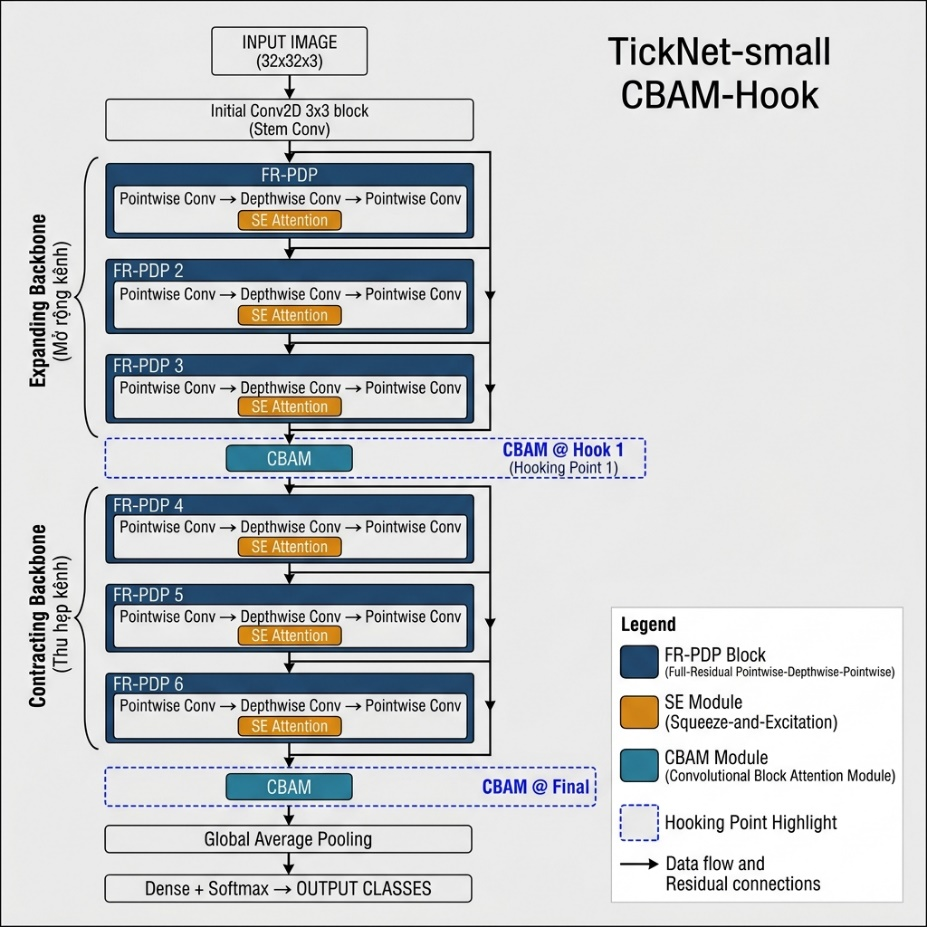
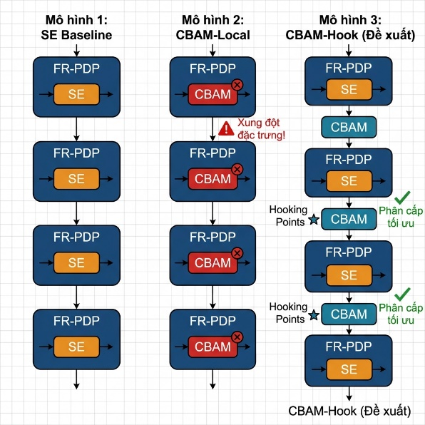
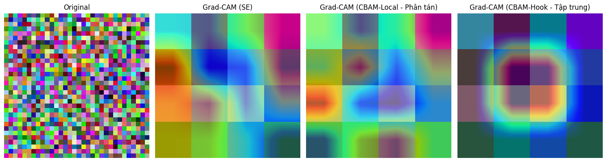
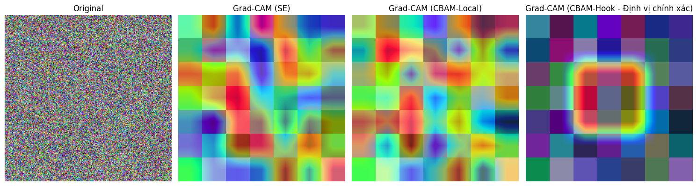

> **BỘ GIÁO DỤC VÀ ĐÀO TẠO**

o

> **TRƯỜNG ĐẠI HỌC NÔNG LÂM TP HCM**
>
> **KHOA CÔNG NGHỆ THÔNG TIN**

TIỂU LUẬN TỐT NGHIỆP

> **TÊN ĐỀ TÀI**

**Nghiên cứu cải tiến TickNets bằng cơ chế**

**attention CBAM cho bài toán phân loại ảnh**

> **Ngành : Công nghệ thông tin.**
>
> **Niên khoá : 2022 – 2026.**
>
> **Lớp : DH22DTC.**
>
> **Sinh viên thực hiện : Chu Toàn Đức.**
>
> **BỘ GIÁO DỤC VÀ ĐÀO TẠO**

**MẪU BÁO CÁO LUẬN VĂN, TIỂU LUẬN TỐT NGHIÊ**

> **TRƯỜNG ĐẠI HỌC NÔNG LÂM TP HCM**
>
> **KHOA CÔNG NGHỆ THÔNG TIN**
>
> TIỂU LUẬN TỐT NGHIỆP
>
> **TÊN ĐỀ TÀI**

**Nghiên cứu cải tiến TickNets bằng cơ chế**

**attention CBAM cho bài toán phân loại ảnh**

> **CÁN BỘ HƯỚNG DẪN** **SINH VIÊN THỰC HIỆN**
>
> TS. Nguyễn Văn Dũ 1. Chu Toàn Đức 22130047
>
> TP.HỒ CHÍ MINH,06 tháng 08 năm 2026

# DANH SÁCH CHỮ VIẾT TẮT

> CBAM **C**onvolutional **B**lock **A**ttention **M**odule
>
> Mô đun chú ý khối tích chập
>
> CAM **C**hannel **A**ttention **M**odule
>
> Mô-đun chú ý theo kênh.
>
> SE **S**queeze-and-**E**xcitation
>
> Nén và kích thích
>
> CNN **C**onvolutional **N**eural **N**etwork
>
> Mạng nơ-ron tích chập.
>
> NLP **N**atural **L**anguage **P**rocessing
>
> Xử lý ngôn ngữ tự nhiên.

CV **C**omputer **V**ision.

Thị giác máy tính.

> SAM **S**patial **A**ttention **M**odule
>
> Mô-đun chú ý theo không gian.
>
> DWConv **D**epth**w**ise **Conv**olution
>
> Tích chập chiều sâu
>
> ERF **E**ffective **R**eceptive **F**ield
>
> Vùng tiếp nhận hiệu dụng
>
> Grad-CAM **Grad**ient-weighted **C**lass **A**ctivation **M**apping
>
> Bản đồ kích hoạt lớp theo gradient
>
> LR **L**earning **R**ate
>
> Tốc độ học
>
> SGD **S**tochastic **G**radient **D**escent
>
> Hạ gradient ngẫu nhiên
>
> NAS **N**eural **A**rchitecture **S**earch
>
> Tìm kiếm kiến trúc thần kinh
>
> PW **P**ointwise **C**onvolution
>
> Tích chập điểm
>
> ReLU **Re**ctified **L**inear **U**nit
>
> Hàm kích hoạt tuyến tính chỉnh lưu
>
> FR-PDP **F**ull-**R**esidual **P**oint-**D**epth-**P**oint
>
> Cơ chế liên kết tàn dư đầy đủ
>
> BAM **B**ottleneck **A**ttention **M**odule
>
> Mô-đun chú ý nút thắt

# DANH MỤC HÌNH ẢNH

[Hình 2.1 Mô-đun chú ý kênh CAM [13](#_Toc236751521)](#_Toc236751521)

[Hình 2.2 Sơ đồ mạng nơ-ron Tensor [14](#_Toc237274076)](#_Toc237274076)

[Hình 2.3 Sơ đồ quy trình CBAM [16](#_Toc236751523)](#_Toc236751523)

[Hình 3.1 Tổng quan bài toán phân loại ảnh [19](#_Toc236751524)](#_Toc236751524)

[Hình 3.2 So sánh cách con người nhìn ảnh trực quan và cách máy tính biểu diễn ảnh tensor $H \times W \times C\ $các giá trị pixel [20](#_Toc236751525)](#_Toc236751525)

[Hình 3.3 Bốn thách thức chính của bài toán phân loại ảnh: biến đổi góc nhìn, biến đổi tỉ lệ, che khuất và đa dạng nội lớp [21](#_Toc236751526)](#_Toc236751526)

[Hình 3.4: Kiến trúc tổng thể mô hình đề xuất TickNet-small CBAM-Hook [27](#_Toc236751527)](#_Toc236751527)

[Hình 3.5 So sánh 3 mô hình : SE Baseline, CBAM-Local, CBAM-Hook [29](#_Toc236751528)](#_Toc236751528)

[Hình 3.6 : So sánh bản đồ nhiệt Grad-CAM của 3 mô hình trên tập Cifar-10 [41](#_Toc236751529)](#_Toc236751529)

[Hình 3.7 So sánh bản đồ nhiệt Grad-CAM của 3 mô hình trên tập PlantVillage [42](#_Toc236751530)](#_Toc236751530)

# DANH MỤC BẢNG

[Bảng 3.1 So sánh kiến trúc 3 mô hình thực nghiệm [27](#_Toc236751806)](#_Toc236751806)

[Hình 3.2 Thông tin tổng quan 2 bộ dữ liệu thực nghiệm [33](#_Toc236751807)](#_Toc236751807)

[Bảng 3.3 So sánh cấu trúc 3 mô hình thực nghiệm [35](#_Toc236751808)](#_Toc236751808)

[Bảng 3.4 Cấu hình siêu tham số huấn luyện cho 2 bộ dữ liệu [36](#_Toc236751809)](#_Toc236751809)

[Bảng 3.5 So sánh hiệu năng 3 mô hình trên tập Cifar-10 [38](#_Toc236751810)](#_Toc236751810)

[Bảng 3.6 So sánh hiệu năng 3 mô hình trên tập PlantVillage [39](#_Toc236751811)](#_Toc236751811)

[Bảng 3.7 Tổng hợp so sánh hiệu năng trên 2 tập dữ liệu [40](#_Toc236751812)](#_Toc236751812)

> **TÓM TẮT**
>
> Bài báo cáo nghiên cứu và đề xuất giải pháp cải tiến kiến trúc TickNet-small bằng cách tích hợp cơ chế chú ý CBAM theo chiến lược phân cấp. Trên cơ sở kế thừa cơ chế SE nội khối của TickNets \[1\], đề tài chèn CBAM tại ba điểm nối chiến lược nhằm tăng cường khả năng hiệu chỉnh đặc trưng theo kênh và không gian. Thực nghiệm được tiến hành trên hai bộ dữ liệu CIFAR-10 và PlantVillage bằng framework PyTorch. Kết quả cho thấy mô hình CBAM-Hook đạt mức cải thiện nhẹ về Accuracy so với mô hình SE Baseline và CBAM-Local. Các kết quả thực nghiệm và trực quan hóa Grad-CAM cung cấp bằng chứng hỗ trợ cho giả thuyết thiết kế của đề tài.

# MỤC LỤC

# 

[DANH SÁCH CHỮ VIẾT TẮT [ii](#danh-sách-chữ-viết-tắt)](#danh-sách-chữ-viết-tắt)

[DANH MỤC HÌNH ẢNH [iii](#danh-mục-hình-ảnh)](#danh-mục-hình-ảnh)

[DANH MỤC BẢNG [iv](#danh-mục-bảng)](#danh-mục-bảng)

[MỤC LỤC [vi](#mục-lục)](#mục-lục)

[MỞ ĐẦU [1](#mở-đầu)](#mở-đầu)

[1. LÝ DO CHỌN ĐỀ TÀI [1](#lý-do-chọn-đề-tài)](#lý-do-chọn-đề-tài)

[2. MỤC TIÊU VÀ PHẠM VI NGHIÊN CỨU [1](#mục-tiêu-và-phạm-vi-nghiên-cứu)](#mục-tiêu-và-phạm-vi-nghiên-cứu)

[3. Ý NGHĨA KHOA HỌC VÀ THỰC TIỄN CỦA ĐỀ TÀI [2](#ý-nghĩa-khoa-học-và-thực-tiễn-của-đề-tài)](#ý-nghĩa-khoa-học-và-thực-tiễn-của-đề-tài)

[CHƯƠNG 1 TỔNG QUAN ĐỀ TÀI [4](#chương-1-tổng-quan-đề-tài)](#chương-1-tổng-quan-đề-tài)

[CHƯƠNG 2 CƠ SỞ LÝ THUYẾT [6](#chương-2-cơ-sở-lý-thuyết)](#chương-2-cơ-sở-lý-thuyết)

[2.1. MẠNG NƠ-RON TÍCH CHẬP NHẸ SIÊU NHẸ TICKNETS: [6](#mạng-nơ-ron-tích-chập-nhẹ-siêu-nhẹ-ticknets)](#mạng-nơ-ron-tích-chập-nhẹ-siêu-nhẹ-ticknets)

[2.1.1. Mạng tích chập siêu nhẹ TickNets [6](#mạng-tích-chập-siêu-nhẹ-ticknets)](#mạng-tích-chập-siêu-nhẹ-ticknets)

[2.1.2 Các khái niệm tích chập tối giản. [7](#các-khái-niệm-tích-chập-tối-giản.)](#các-khái-niệm-tích-chập-tối-giản.)

[2.1.3 Kiến trúc khối Full-Residual Point-Depth-Point [8](#kiến-trúc-khối-full-residual-point-depth-point)](#kiến-trúc-khối-full-residual-point-depth-point)

[2.1.4 Cấu trúc xương sống co giãn kênh hình dấu tích và mô hình TickNet-small [9](#cấu-trúc-xương-sống-co-giãn-kênh-hình-dấu-tích-và-mô-hình-ticknet-small)](#cấu-trúc-xương-sống-co-giãn-kênh-hình-dấu-tích-và-mô-hình-ticknet-small)

[2.1.5 Cơ chế lan truyền đặc trưng và cách thức hoạt động của TickNets [10](#cơ-chế-lan-truyền-đặc-trưng-và-cách-thức-hoạt-động-của-ticknets)](#cơ-chế-lan-truyền-đặc-trưng-và-cách-thức-hoạt-động-của-ticknets)

[2.2 CƠ CHẾ CHÚ Ý ATTENTION MECHANISM [11](#cơ-chế-chú-ý-attention-mechanism)](#cơ-chế-chú-ý-attention-mechanism)

[2.2.1 Squeeze-and-Excitation mặc định trong TickNets [11](#squeeze-and-excitation-mặc-định-trong-ticknets)](#squeeze-and-excitation-mặc-định-trong-ticknets)

[2.2.2 Channel Attention Module [13](#channel-attention-module)](#channel-attention-module)

[2.2.3 Spatial Attention Module [14](#spatial-attention-module)](#spatial-attention-module)

[2.2.4 Mô-đun chú ý khối tích chập CBAM hoạt động tuần tự CAM + SAM [15](#mô-đun-chú-ý-khối-tích-chập-cbam-hoạt-động-tuần-tự-cam-sam)](#mô-đun-chú-ý-khối-tích-chập-cbam-hoạt-động-tuần-tự-cam-sam)

[2.3. PHƯƠNG PHÁP NGHIÊN CỨU [17](#phương-pháp-nghiên-cứu)](#phương-pháp-nghiên-cứu)

[CHƯƠNG 3 BÀI TOÁN PHÂN LOẠI HÌNH ẢNH VÀ ĐỀ XUẤT CẢI TIẾN [19](#chương-3-bài-toán-phân-loại-hình-ảnh-và-đề-xuất-cải-tiến)](#chương-3-bài-toán-phân-loại-hình-ảnh-và-đề-xuất-cải-tiến)

[3.1 GIỚI THIỆU BÀI TOÁN PHÂN LOẠI HÌNH ẢNH [19](#giới-thiệu-bài-toán-phân-loại-hình-ảnh)](#giới-thiệu-bài-toán-phân-loại-hình-ảnh)

[3.1.1 Phát biểu bài toán [19](#phát-biểu-bài-toán)](#phát-biểu-bài-toán)

[3.1.2 Biểu diễn hình ảnh trong máy tính [20](#biểu-diễn-hình-ảnh-trong-máy-tính)](#biểu-diễn-hình-ảnh-trong-máy-tính)

[3.1.3 Thách thức của bài toán [21](#thách-thức-của-bài-toán)](#thách-thức-của-bài-toán)

[3.1.4 Ứng dụng thực tiễn [22](#ứng-dụng-thực-tiễn)](#ứng-dụng-thực-tiễn)

[3.1.5 Các phương pháp tiếp cận bài toán phân loại hình ảnh [23](#các-phương-pháp-tiếp-cận-bài-toán-phân-loại-hình-ảnh)](#các-phương-pháp-tiếp-cận-bài-toán-phân-loại-hình-ảnh)

[3.1.6 Vai trò của cơ chế chú ý trong bài toán phân loại ảnh [24](#vai-trò-của-cơ-chế-chú-ý-trong-bài-toán-phân-loại-ảnh)](#vai-trò-của-cơ-chế-chú-ý-trong-bài-toán-phân-loại-ảnh)

[3.2 ĐỀ XUẤT MÔ HÌNH TICKNETS KẾT HỢP CƠ CHẾ CHÚ Ý PHÂN CẤP HIERARCHICAL ATTENTION [24](#đề-xuất-mô-hình-ticknets-kết-hợp-cơ-chế-chú-ý-phân-cấp-hierarchical-attention)](#đề-xuất-mô-hình-ticknets-kết-hợp-cơ-chế-chú-ý-phân-cấp-hierarchical-attention)

[3.2.1 Thiết kế kiến trúc đề xuất TickNet-small CBAM-Hook [24](#thiết-kế-kiến-trúc-đề-xuất-ticknet-small-cbam-hook)](#thiết-kế-kiến-trúc-đề-xuất-ticknet-small-cbam-hook)

[3.2.2 Cơ chế chú ý phân cấp [28](#cơ-chế-chú-ý-phân-cấp)](#cơ-chế-chú-ý-phân-cấp)

[3.2.3 Phân tích giả thuyết về khả năng chồng chéo xử lý không gian giữa DWConv và SAM [30](#phân-tích-giả-thuyết-về-khả-năng-chồng-chéo-xử-lý-không-gian-giữa-dwconv-và-sam)](#phân-tích-giả-thuyết-về-khả-năng-chồng-chéo-xử-lý-không-gian-giữa-dwconv-và-sam)

[3.3 HIỆN THỰC GIẢI PHÁP [32](#hiện-thực-giải-pháp)](#hiện-thực-giải-pháp)

[3.3.1 Môi trường thực nghiệm và xây dựng mô hình [32](#môi-trường-thực-nghiệm-và-xây-dựng-mô-hình)](#môi-trường-thực-nghiệm-và-xây-dựng-mô-hình)

[3.3.2 Nhóm hai bộ dữ liệu thực nghiệm [32](#nhóm-hai-bộ-dữ-liệu-thực-nghiệm)](#nhóm-hai-bộ-dữ-liệu-thực-nghiệm)

[3.3.3 Phương pháp tiền xử lý dữ liệu và tăng cường dữ liệu cho từng nhóm ảnh [33](#phương-pháp-tiền-xử-lý-dữ-liệu-và-tăng-cường-dữ-liệu-cho-từng-nhóm-ảnh)](#phương-pháp-tiền-xử-lý-dữ-liệu-và-tăng-cường-dữ-liệu-cho-từng-nhóm-ảnh)

[3.3.4 Hiện thực hóa 3 mô hình đối chứng thực nghiệm [34](#hiện-thực-hóa-3-mô-hình-đối-chứng-thực-nghiệm)](#hiện-thực-hóa-3-mô-hình-đối-chứng-thực-nghiệm)

[3.3.5 Cấu hình quá trình huấn luyện và tối ưu hóa [36](#cấu-hình-quá-trình-huấn-luyện-và-tối-ưu-hóa)](#cấu-hình-quá-trình-huấn-luyện-và-tối-ưu-hóa)

[3.3.6 Các độ đo hiệu năng Accuracy, Precision, Recall, F1-score và Confusion Matrix [37](#các-độ-đo-hiệu-năng-accuracy-precision-recall-f1-score-và-confusion-matrix)](#các-độ-đo-hiệu-năng-accuracy-precision-recall-f1-score-và-confusion-matrix)

[3.3.7 Kết quả thực nghiệm và biểu đồ Loss/Accuracy trên tập dữ liệu CIFAR-10 [38](#kết-quả-thực-nghiệm-và-biểu-đồ-lossaccuracy-trên-tập-dữ-liệu-cifar-10)](#kết-quả-thực-nghiệm-và-biểu-đồ-lossaccuracy-trên-tập-dữ-liệu-cifar-10)

[3.3.8 Kết quả thực nghiệm và biểu đồ Loss/Accuracy trên tập dữ liệu PlantVillage [39](#kết-quả-thực-nghiệm-và-biểu-đồ-lossaccuracy-trên-tập-dữ-liệu-plantvillage)](#kết-quả-thực-nghiệm-và-biểu-đồ-lossaccuracy-trên-tập-dữ-liệu-plantvillage)

[3.3.9 Phân tích hiện tượng suy giảm hiệu năng cục bộ CBAM-Local và ưu thế của giải pháp đề xuất CBAM-Hook [39](#phân-tích-hiện-tượng-suy-giảm-hiệu-năng-cục-bộ-cbam-local-và-ưu-thế-của-giải-pháp-đề-xuất-cbam-hook)](#phân-tích-hiện-tượng-suy-giảm-hiệu-năng-cục-bộ-cbam-local-và-ưu-thế-của-giải-pháp-đề-xuất-cbam-hook)

[3.3.10 Giải thích mô hình bằng trực quan hóa bản đồ nhiệt Grad-CAM. Sự tập trung vùng không gian đặc trưng thực tế [40](#giải-thích-mô-hình-bằng-trực-quan-hóa-bản-đồ-nhiệt-grad-cam.-sự-tập-trung-vùng-không-gian-đặc-trưng-thực-tế)](#giải-thích-mô-hình-bằng-trực-quan-hóa-bản-đồ-nhiệt-grad-cam.-sự-tập-trung-vùng-không-gian-đặc-trưng-thực-tế)

[CHƯƠNG 4: KẾT QUẢ, KẾT LUẬN VÀ KIẾN NGHỊ [43](#chương-4-kết-quả-kết-luận-và-kiến-nghị)](#chương-4-kết-quả-kết-luận-và-kiến-nghị)

[4.1 KẾT QUẢ [43](#kết-quả)](#kết-quả)

[4.2 KẾT LUẬN [44](#kết-luận)](#kết-luận)

[4.3 KIẾN NGHỊ [45](#kiến-nghị)](#kiến-nghị)

[TÀI LIỆU THAM KHẢO [47](#_Toc237349145)](#_Toc237349145)

# 

# MỞ ĐẦU

## LÝ DO CHỌN ĐỀ TÀI

> Phân loại hình ảnh là một trong những bài toán cơ bản trong thị giác máy tính. Bài toán này được phát biểu như sau: cho một hình ảnh, cần xác định hình ảnh này thuộc lớp nào trong một số lớp cho trước. Ngày nay nó được áp dụng rộng rãi trong hầu hết các lĩnh vực như quản lý chất lượng sản phẩm, ô tô tự lái, y tế, …Vì vậy việc nâng cao tính chính xác của việc phân loại hình ảnh là một trong những vấn đề cấp thiết.
>
> TickNet là một kiến trúc CNN ( Convolutional Neural Network – mạng nơ ron tích chập ) nhẹ được thiết kế nhằm giảm số lượng tham số và chi phí tính toán nhưng vẫn duy trì hiệu quả phân loại cao thông qua khối Full-Residual Point-Depth-Point (FR-PDP-cơ chế tàn dư đầy đủ) và cấu trúc Tick-shape Backbone \[1\]. Tuy nhiên, mô hình TickNets gốc mới chỉ sử dụng cơ chế chú ý theo kênh Squeeze-and-Excitation trong mỗi khối FR-PDP và chưa tích hợp một cơ chế chú ý không gian như CBAM. Trong phần hướng phát triển, tác giả TickNets có đề cập BAM (Bottleneck Attention Module- Mô-đun chú ý nút thắt) và CBAM (Convolutional Block Attention Module – mô đun chú ý khối tích chập) có thể được khảo sát trong các nghiên cứu tiếp theo \[1\]. Trên cơ sở đó, đề tài nghiên cứu một chiến lược tích hợp CBAM vào TickNet-small.
>
> Trong số các cơ chế Attention, Convolutional Block Attention Module là một mô-đun nhẹ, có khả năng cải thiện việc trích xuất đặc trưng bằng cách kết hợp chú ý theo kênh và chú ý theo không gian. Vì vậy, việc nghiên cứu tích hợp CBAM vào TickNet-Small nhằm nâng cao hiệu quả phân loại ảnh là một hướng nghiên cứu có ý nghĩa cả về mặt học thuật và ứng dụng thực tiễn.
>
> Xuất phát từ những lý do trên, đề tài "Nghiên cứu cải tiến TickNet-Small bằng cơ chế Attention CBAM cho bài toán phân loại ảnh" được lựa chọn thực hiện.

## MỤC TIÊU VÀ PHẠM VI NGHIÊN CỨU

> Mục tiêu của đề tài hướng đến việc nghiên cứu kiến trúc TickNet-Small và cơ chế Attention CBAM, từ đó đề xuất mô hình TickNet-Small kết hợp CBAM nhằm nâng cao hiệu quả của bài toán phân loại ảnh. Đồng thời, tiến hành thực nghiệm trên nhiều bộ dữ liệu khác nhau để đánh giá khả năng cải thiện hiệu suất của mô hình so với TickNet-Small gốc.
>
> Phạm vi nghiên cứu:
>
> Nghiên cứu kiến trúc TickNet, khối FR-PDP và cấu trúc Tick-shape Backbone.
>
> Nghiên cứu cơ chế Attention, đặc biệt là Convolutional Block Attention Module.
>
> Xây dựng mô hình TickNet-Small kết hợp CBAM.
>
> Huấn luyện và đánh giá ba biến thể mô hình TickNet-small trên hai bộ dữ liệu CIFAR-10 và PlantVillage.
>
> Mô hình được hiện thực bằng Python và framework PyTorch. Quá trình huấn luyện sử dụng bộ tối ưu hóa SGD, bộ điều chỉnh tốc độ học ReduceLROnPlateau và cơ chế dừng sớm.
>
> Đánh giá hiệu năng dựa trên các độ đo tiêu chuẩn: Accuracy, Precision, Recall, F1-score cùng trực quan hóa bằng Confusion Matrix và bản đồ nhiệt Grad-CAM để giải thích vùng chú ý của mô hình.

## Ý NGHĨA KHOA HỌC VÀ THỰC TIỄN CỦA ĐỀ TÀI

> Đề tài xây dựng một giả thuyết kiến trúc về khả năng chồng chéo xử lý không gian giữa DWConv và SAM khi CBAM được đặt cục bộ bên trong khối FR-PDP. Trên cơ sở đó, đề tài đề xuất chiến lược giữ SE nội khối và chèn CBAM tại các điểm nối mạng, sau đó đánh giá giả thuyết thông qua thực nghiệm đối chứng.
>
> Đề tài đề xuất một cấu trúc chú ý phân cấp hai tầng, trong đó SE thực hiện tái hiệu chỉnh kênh ở cấp độ nội khối, còn CBAM thực hiện hiệu chỉnh kênh và không gian tại các điểm nối ngoại khối.
>
> Góp phần phát triển lý thuyết học sâu giải thích được : Thông qua việc ứng dụng thuật toán Grad-CAM để trực quan hóa các bản đồ nhiệt chú ý , đề tài cung cấp các minh chứng khoa học trực quan, rõ ràng giải thích tại sao mô hình cải tiến có thể hội tụ nhanh hơn, định vị chính xác hơn các vùng bệnh lý hoặc vật thể so với mô hình baseline thông thường…
>
> Ý nghĩa thực tiễn: kết quả nghiên cứu trình bày trong tiểu luận có ý nghĩa rất lớn khi áp dụng vào các bài toán trong thực tiễn như sau:
>
> Kết quả trên PlantVillage cho thấy tiềm năng ứng dụng của mô hình trong bài toán phân loại bệnh lá cây trên ảnh được thu thập trong điều kiện tương đối kiểm soát. Để đánh giá khả năng sử dụng ngoài thực địa, mô hình vẫn cần được kiểm chứng trên dữ liệu có nền tự nhiên, điều kiện ánh sáng thay đổi, che khuất và nhiều mức độ nhiễu khác nhau.
>
> Tính khả thi cao trong triển khai thực tế trên thiết bị biên: Nhờ kế thừa ưu điểm siêu nhẹ của mạng TickNets, mô hình TickNet-small cải tiến bằng CBAM phân cấp có tiềm năng triển khai trên thiết bị biên nhờ số lượng tham số tương đối thấp, tuy nhiên cần đo thêm thời gian suy luận, bộ nhớ và năng lượng trên phần cứng thực tế trên các thiết bị di động cá nhân, máy tính bảng cầm tay, thiết bị bay không người lái hay các chip nhúng biên IoT có năng lượng và năng lực tính toán hạn chế mà không cần phụ thuộc vào máy chủ đám mây.

- 

# CHƯƠNG 1 TỔNG QUAN ĐỀ TÀI

> Cơ chế chú ý là một trong những cơ chế được sử dụng phổ biến trong các bài toán xử lý ngôn ngữ tự nhiên, đặc biệt là trong các mô hình dịch máy. Một trong những thành tựu nổi bật của nó là sự phát triển của mô hình Transformer, giới thiệu trong bài báo “Attention is All You Need” của Vaswani et al. năm 2017 \[2\]. Mô hình Transformer đã thay đổi cách tiếp cận dịch máy và các bài toán xử lý ngôn ngữ tự nhiên nhờ vào cơ chế Attention mạnh mẽ của nó. Góp phần dẫn đến sự phát triển của các mô hình như BERT và GPT. Những mô hình này đã thiết lập các chuẩn mực mới trong nhiều bài toán NLP khác nhau, bao gồm dịch máy, hiểu ngôn ngữ tự nhiên, và tạo văn bản.
>
> Mặc dù các nghiên cứu tích hợp cơ chế chú ý như CBAM đã chứng minh hiệu quả vượt trội khi kết hợp với các mạng tích chập truyền thống như VGG16 , việc áp dụng cơ chế này lên các kiến trúc mạng siêu nhẹ vẫn đối mặt với nhiều thách thức lớn về sự tương thích cấu trúc . Các mạng siêu nhẹ phổ biến hiện nay như MobileNets hay ShuffleNets thường chỉ sử dụng cơ chế chú ý một hướng SE để tái cấu trúc kênh đặc trưng nhằm tiết kiệm tham số . Kiến trúc mạng siêu nhẹ cải tiến gần đây là TickNets – nổi bật với khối FR-PDP và cấu trúc xương sống co giãn kênh hình dấu tích tuy đạt hiệu suất cao nhưng cũng mới chỉ dừng lại ở việc tích hợp mặc định cơ chế attention SE ở mức cục bộ bên trong khối.
>
> Bài báo TickNets gốc không hiện thực CBAM trong kiến trúc. Các đóng góp của công trình gốc tập trung vào khối FR-PDP, cơ chế full-residual, tick-shape backbone và việc ghép nối nhiều backbone để hình thành các phiên bản TickNets. CBAM chỉ được tác giả đề cập như một hướng nghiên cứu tiếp theo. Vì vậy, chiến lược CBAM-Hook trong tiểu luận là đề xuất mở rộng của đề tài, không phải thành phần của TickNet-small nguyên bản.
>
> Do đó, bài nghiên cứu này tập trung vào giải pháp cải tiến mạng TickNet-small bằng cơ chế chú ý phân cấp. Phương pháp này đề xuất giữ nguyên SE cục bộ trong khối FR-PDP, đồng thời chèn CBAM một cách chiến lược tại các điểm nối mạng giữa hai backbone co giãn và trước lớp Global Average Pooling cuối mạng , giúp mô hình phát huy tối đa sức mạnh lọc nhiễu không gian toàn cục mà không làm bùng nổ tham số tính toán.

# CHƯƠNG 2 CƠ SỞ LÝ THUYẾT

## MẠNG NƠ-RON TÍCH CHẬP NHẸ SIÊU NHẸ TICKNETS:

### Mạng tích chập siêu nhẹ TickNets

> Trong xu hướng phát triển của học sâu ứng dụng trên các thiết bị di động và hệ thống nhúng, các mạng nơ-ron tích chập siêu nhẹ đóng vai trò tối quan trọng nhờ khả năng cân bằng giữa kích thước mô hình tối giản, độ phức tạp tính toán thấp và hiệu suất năng lượng tối ưu. Các kiến trúc kinh điển như MobileNets, ShuffleNets \[3\] hay EfficientNets \[4\] đã gặt hái được nhiều thành công nhờ thay thế các phép tích chập tiêu chuẩn bằng các phép tích chập tối giản có chi phí thấp \[1\].
>
> Tuy nhiên các kiến trúc siêu nhẹ truyền thống này vẫn tồn tại hai hạn chế cấu trúc cốt lõi:
>
> Sự bùng nổ tham số ở các tầng cuối: Backbone của các mạng này được thiết kế theo nguyên tắc tăng dần đều số lượng kênh đặc trưng. Khi mạng càng đi sâu, số lượng kênh ở các tầng cuối cùng tăng lên rất lớn, dẫn đến kích thước mô hình bị phình to ra nhanh chóng.
>
> Sự thiếu hụt liên kết đồng nhất. Dựa trên cơ chế kết nối tàn dư nhằm giải quyết vấn đề triệt tiêu gradient , các mạng siêu nhẹ thường sử dụng các liên kết tắt . Tuy nhiên, các liên kết tắt này chỉ là bán tàn dư , tức là chúng chỉ được kích hoạt khi kích thước không gian và số lượng kênh đặc trưng giữa đầu vào và đầu ra hoàn toàn trùng khớp. Khi xảy ra sự thay đổi kích thước không gian do bước trượt tích chập s \> 1 hoặc sự thay đổi số lượng kênh đặc trưng giữa các khối nơ-ron, liên kết đồng nhất bị phá vỡ.
>
> Để khắc phục triệt để các hạn chế trên, họ mạng TickNets được đề xuất như một kiến trúc mạng tích chập siêu nhẹ thế hệ mới dựa trên ba đóng góp khoa học chính: khối tích chập tối giản FR-PDP sử dụng liên kết tàn dư đầy đủ để duy trì các liên kết đồng nhất trực tiếp trong mọi điều kiện, cấu trúc xương sống co giãn kênh hình dấu tích nhằm tối ưu hóa phân bổ tham số để linh hoạt tùy biến độ sâu của mô hình.

### Các khái niệm tích chập tối giản.

> Để giảm chi phí tính toán cực kỳ đắt đỏ của các phép tích chập tiêu chuẩn vốn đòi hỏi dung lượng bộ nhớ lớn , họ mạng TickNets tận dụng các phép tích chập tối giản, bao gồm tích chập chiều sâu và tích chập điểm.
>
> **Phép tích chập tiêu chuẩn** **:** Cho một tensor đầu vào $\mathcal{T \in}\mathbb{R}^{C_{in} \times H \times W}$ với $C_{in}$ là số lượng kênh đầu vào, H$\times$W là kích thước không gian của mỗi kênh đặc trưng. Phép tiêu chuẩn biến đổi $\mathcal{T}$ thành một tensor đầu ra $\mathcal{T}_{\mu} \in \mathbb{R}^{C_{out} \times H \times W}$ bằng cách áp dụng $C_{out}$ bộ lọc kernels kích thước $C_{in} \times K\  \times K\ :$
>
> $$\mathcal{T}_{\mu}\  = \mu_{i}\mathcal{*T,\ }i\ \  = \ 1,\ \ldots,\ C_{out}$$
>
> Chi phí tính toán của phép toán này là cực kỳ lớn và tỷ lệ thuận với tích của cả số kênh đầu vào và đầu ra:
>
> $$\mathcal{O}\left( H\  \times W\  \times C_{in} \times C_{out} \times K\  \times K \right)$$
>
> **Phép tích chập chiều sâu :** Để tối giản hóa quá trình trích xuất đặc trưng không gian, phép tích chập chiều sâu tách biệt quá trình lọc theo từng kênh đặc trưng $c_{j}$ của tensor đầu vào $\mathcal{T}$ bằng cách sử dụng các bộ lọc độc lập kích thước $1 \times K \times K\ $:
>
> $$\mathcal{T}_{d} = \xi_{i}*c_{j}\ ,\ \ j = 1,\ldots,C_{in}$$
>
> Trong đó, $\mathcal{T}_{d} \in \mathbb{R}^{C_{in} \times H \times W}$và $\xi_{i}$ đại diện cho bộ lọc tương ứng với kênh đặc trưng thứ j . Phép toán này chỉ thực hiện vai trò lọc không gian mà không tạo ra bất kỳ sự tương tác kênh mới nào.
>
> **Phép tích chập điểm :** Nhằm tổng hợp và thiết lập các mối quan hệ phi tuyến giữa các kênh đặc trưng sau khi đã được lọc không gian bởi phép tích chập chiều sâu, phép tích chập điểm được áp dụng bằng cách sử dụng các bộ lọc kích thước $C_{in} \times 1 \times 1$ quét qua các điểm ảnh :
>
> $$\mathcal{T}_{p} = \ \zeta_{j}*\ \mathcal{T}_{d},\ \ j\  = \ 1,\ \ldots,\ C_{out}$$
>
> Hệ quả là thu được tensor đặc trưng mới $\mathcal{T}_{p} \in \mathbb{R}^{C_{out} \times H \times W}$. . Phép toán này đóng vai trò quan trọng trong việc co giãn linh hoạt số lượng kênh đặc trưng.dựa trên mục tiêu thiết kế kiến trúc \[5\].

### Kiến trúc khối Full-Residual Point-Depth-Point

> Trọng tâm cải tiến của họ mạng TickNets nằm ở thiết kế khối FR-PDP. Khối này kết hợp mô-đun trích xuất đặc trưng phân tầng PDP độc đáo với cơ chế liên kết tàn dư đầy đủ để khắc phục tình trạng gián đoạn liên kết đồng nhất khi mạng thực hiện giảm chiều không gian hoặc co giãn kênh .
>
> **Mô-đun trích xuất đặc trưng Point-Depth-Point**. Khác với khối Bottleneck ngược của MobileNetV2 mở rộng số kênh ở đầu khối, khối PDP thực hiện nén và giữ nguyên số lượng kênh đặc trưng ở giai đoạn đầu để bảo toàn các thông tin đặc trưng nguyên bản. Quy trình biến đổi một tensor đầu vào $\mathcal{T \in}\mathbb{R}^{C_{in} \times H \times W}\ $qua mô đun PDP bao gồm 4 bước liên tiếp:
>
> Bước 1 - Tích chập điểm thứ nhất : Áp dụng $C_{in}$ bộ lọc kích thước $1 \times 1$ với bước trượt $s = 1\ $để tạo ra các đặc trưng điểm ảnh được nén nhưng giữ nguyên chiều sâu kênh gốc nhằm cung cấp đầu vào chất lượng cho tích chập chiều sâu :
>
> $$\mathcal{P}_{w1} = \ \zeta_{j}\mathcal{*\ T,\ \ \ }j\  = \ 1,\ \ldots,\ C_{in}$$
>
> Bước 2 - Tích chập chiều sâu : Sử dụng bộ lọc kích thước $3 \times 3$ với bước trượt $s = 1\ $hoặc $s > 1$ trong trường hợp cần giảm kích thước không gian để học các đặc trưng trong cục bộ.
>
> $$\mathcal{D}_{ws} = \xi_{j}^{3 \times 3}*c_{j} \in \mathcal{P}_{w1},\quad j = 1,\ldots,C_{in}$$
>
> Bước 3 - Tích chập điểm thứ 2 : Thiết lập sự tương tác kênh và co giãn số lượng kênh đặc trưng đầu ra thành $C_{out}$ kênh theo cấu hình thiết kế bằng phép tích chập điểm tuần tự:
>
> $$\mathcal{P}_{w2} = \mu_{j}*\mathcal{D}_{ws},\quad j = 1,\ldots,C_{out}$$
>
> Bước 4 - Cơ chế chú ý kênh : Để tối ưu hóa biểu diễn đặc trưng, khối PDP áp dụng cơ chế chú ý SE với tỷ lệ giảm mặc định $r = 16$ \[6\]. Khác biệt cốt lõi của TickNets là tính toán trọng số chú ý trực tiếp từ các đặc trưng điểm ảnh phong phú của$\mathcal{\ P}_{w2}$ thay vì các đặc trưng lọc thô của lớp tích chập chiều sâu:
>
> $$\mathcal{T}_{PDP} = c_{k} \otimes f_{k},\quad k = 1,\ldots,C_{out}\quad$$
>
> Trong đó, $\otimes$ ký hiệu phép nhân theo từng kênh đặc trưng, và $f_{k} \in \mathcal{F}_{\mathcal{P}_{w2}}$ đại diện cho bộ trọng số chú ý kênh được học từ $\mathcal{P}_{w2}$.
>
> **Cơ chế liên kết tàn dư đầy đủ.** Để duy trì liên kết đồng nhất ngay cả khi kích thước không gian hoặc số lượng kênh của $T$ thay đổi so với đầu ra $\ \mathcal{T}_{PDP}$ , TickNets đề xuất giải pháp sử dụng một phép tích chập điểm phụ trợ $\mathcal{P}_{wRs}$ để chuyển đổi tensor đầu vào $\mathcal{T}$ về cùng cấu trúc không gian và số lượng kênh đặc trưng với đầu ra :
>
> $$\mathcal{P}_{wRs} = \nu_{j}*\mathcal{T},\quad j = 1,\ldots,C_{out}\quad$$
>
> Trong đó, $\mathcal{P}_{wRs} \in \mathbb{R}^{C_{out} \times H_{s} \times W_{s}}$ sử dụng bước trượt $s$ đồng bộ với bước trượt của lớp tích chập chiều sâu $\mathcal{D}_{ws}$ . Công thức tổng hợp đầu ra khối FR-PDP được định nghĩa hoàn chỉnh như sau:
>
> $$\mathcal{T}_{FR - PDP} = \left\{ \begin{matrix}
> \mathcal{T} \oplus \mathcal{T}_{PDP}, & \text{nếu~}s = 1\text{~và~}\left| \mathcal{T} \right| = \left| \mathcal{T}_{PDP} \right| \\
> \mathcal{P}_{wRs} \oplus \mathcal{T}_{PDP}, & \text{trong~các~trường~hợp~khác}
> \end{matrix} \right.\ \quad$$
>
> Trong đó, $\oplus$ là phép toán cộng ma trận theo từng phần tử. Giải pháp này đảm bảo mạng luôn khai thác được hai luồng thông tin tàn dư song song để tối đa hóa hiệu năng trích xuất đặc trưng.

### Cấu trúc xương sống co giãn kênh hình dấu tích và mô hình TickNet-small

> Một đặc trưng độc bản của họ mạng TickNets là thiết kế hệ thống phân bổ kênh đặc trưng theo mô hình co giãn kênh hình dấu tích phá vỡ tư duy tăng kênh tuyến tính truyền thống để giảm thiểu tối đa sự bùng nổ tham số thừa.
>
> **Xương sống hình dấu tích cơ bản .** Một xương sống hình dấu tích cơ bản được thiết lập bởi một chuỗi tuần tự gồm 5 khối FR-PDP. Sự co giãn số lượng kênh đặc trưng đầu ra $C_{out\ }$của chuỗi 5 khối này biến thiên tăng giảm nhịp nhàng mô phỏng theo hình dáng của một dấu tích :
>
> $$Tick\_ B\left( \mathcal{T} \right) = \Psi_{s}^{512}\left( \Psi_{s}^{256}\left( \Psi_{s}^{128}\left( \Psi_{s}^{64}\left( \Psi_{s}^{128}\left( \mathcal{T} \right) \right) \right) \right) \right)\quad$$
>
> Trong đó, $\Psi_{s}^{C_{out}}\ $ký hiệu phép xử lý của một khối FR-PDP cho ra số kênh $C_{out}$ với bước trượt $s$. Số lượng kênh đặc trưng trải qua chu kỳ co giãn tuần tự: $128\  \rightarrow 64 \rightarrow 128 \rightarrow 256 \rightarrow 512$.
>
> Việc co hẹp số lượng kênh đặc trưng về mức cực tiểu 64 kênh ở giai đoạn đầu và chỉ mở rộng mạnh mẽ ở khối cuối cùng giúp kiểm soát nghiêm ngặt dung lượng mô hình và loại bỏ các đặc trưng thừa.
>
> **Kiến trúc mạng TickNet-small .** Tận dụng tính chất co giãn kênh linh hoạt của xương sống cơ bản, mạng TickNet-small được xây dựng bằng phương pháp ghép nối trực tiếp hai xương sống hình dấu tích tuần tự thông qua cơ chế hooking:
>
> $$\mathcal{T}ick\mathcal{N}et\text{-small}\left( \mathcal{T} \right) = \mathcal{T}ick\_ B\left( \mathcal{T}ick\_ B\left( \mathcal{T} \right) \right)\quad$$
>
> Cấu trúc hoàn chỉnh của TickNet-small bao gồm 10 khối FR-PDP liên kết chặt chẽ. Cấu hình phân bổ số lượng kênh đặc trưng cho 10 khối này được triển khai chi tiết theo chuỗi co giãn đôi tương ứng với hai xương sống hình dấu tích được ghép nối tiếp: $128 \rightarrow 64 \rightarrow 128 \rightarrow 256 \rightarrow 512 \rightarrow 128 \rightarrow 64 \rightarrow 128 \rightarrow 256 \rightarrow 512$. \[1\]
>
> Nhờ giải pháp co giãn kênh đặc trưng này, TickNet-small chỉ sở hữu vỏn vẹn khoảng 3 triệu tham số huấn luyện trên tập dữ liệu ImageNet-1k. Con số này tối giản hơn đáng kể so với mức 3.51 triệu tham số của mô hình MobileNetV2 \[7\] nhưng vẫn giúp mạng đạt được độ sâu trích xuất đặc trưng vượt trội.

### Cơ chế lan truyền đặc trưng và cách thức hoạt động của TickNets

> Quy trình truyền xuôi của mạng TickNet-small hoạt động tuần tự để trích xuất đặc trưng hình ảnh phân cấp thông qua các lớp tính toán được tối ưu hóa như sau:
>
> Giai đoạn xử lý ban đầu. Hình ảnh đầu vào kích thước chuẩn $224 \times 224 \times 3$ đi qua lớp tích chập tiêu chuẩn đầu tiên $Initial\_ conv3 \times 3$ có kích thước bộ lọc $3 \times 3$ với bước trượt $s = 2$ để nén kích thước không gian xuống $112 \times 112\ $và tăng kênh lên 32.
>
> Giai đoạn lan truyền qua Backbone 1. Tensor đặc trưng được lan truyền qua xương sống thứ nhất. Quá trình giảm kích thước bản đồ đặc trưng được thực hiện một cách chiến lược bằng cách áp dụng bước trượt $s = 2\ $tại khối 1, 3, 4, và 5. Đầu ra của backbone thứ nhất đạt kích thước $7 \times 7$ với số kênh đặc trưng là 512.
>
> Giai đoạn lan truyền qua Backbone 2. Sau khi đi qua điểm nối mạng (Hooking point), đặc trưng tiếp tục lan truyền qua xương sống dấu tích thứ hai với bước trượt $s = 1$ tại tất cả các khối để tập trung học sâu các đặc trưng ngữ nghĩa nâng cao. Đầu ra cuối cùng duy trì kích thước $7 \times 7 \times 512$ .
>
> Giai đoạn phân loại cuối. Bản đồ đặc trưng được tăng cường kênh đặc trưng lên 1024 bằng lớp tích chập điểm $Final\_ conv1 \times 1$, sau đó làm phẳng qua lớp AvgPooling thành vector đặc trưng 1D có kích thước 1024, trước khi đi qua lớp phân loại để tạo vector logits cho các lớp. Trong quá trình huấn luyện, logits được đưa trực tiếp vào CrossEntropyLoss. Khi suy luận, có thể áp dụng Softmax lên logits để chuyển thành phân phối xác suất.
>
> Lưu ý cấu hình thực nghiệm: Đối với việc phân loại các hình ảnh kích thước rất nhỏ như CIFAR-10 $32 \times 32$, mạng TickNet-small sẽ cấu hình bước trượt $s = 1\ $cho hai khối FR-PDP đầu tiên FR-PDP-1 và FR-PDP-2 để bảo toàn tối đa các đặc trưng không gian mịn của ảnh tránh bị mất mát thông tin quá sớm.

## CƠ CHẾ CHÚ Ý ATTENTION MECHANISM

### Squeeze-and-Excitation mặc định trong TickNets

> Cơ chế chú ý trong mạng nơ-ron nhân tạo là một kỹ thuật toán học mô phỏng theo hệ thống nhận thức trực quan của con người, giúp mô hình tự động gán trọng số và tập trung vào các vùng thông tin có giá trị cao đồng thời bỏ qua các vùng thông tin nhiễu. Trong các kiến trúc mạng nơ-ron tích chập siêu nhẹ, cơ chế chú ý theo kênh Squeeze-and-Excitation, được đề xuất bởi Hu và các cộng sự , là một giải pháp tối giản nhưng mang lại hiệu năng biểu diễn đặc trưng vượt trội bằng cách thiết lập các mối quan hệ phụ thuộc lẫn nhau giữa các kênh đặc trưng.
>
> Khác biệt cốt lõi của việc tích hợp SE trong khối cơ bản FR-PDP của mạng TickNets so với các mạng nơ-ron truyền thống nằm ở vị trí thu thập thông tin. Thay vì tính toán trọng số chú ý từ các đặc trưng thô sau lớp tích chập chiều sâu vốn chỉ mang tính chất lọc không gian đơn lẻ và chưa thiết lập tương tác kênh TickNets thực hiện trích xuất thông tin chú ý trực tiếp từ bản đồ đặc trưng điểm tích lũy $\mathcal{P}_{w2}$ thu được từ lớp tích chập điểm thứ hai :
>
> $$\mathcal{F}_{\mathcal{P}_{w2}} = \mathbf{F}_{ex}\left( \mathbf{F}_{sq}\left( \mathcal{P}_{w2} \right),\mathbf{W} \right)$$
>
> Quy trình tính toán của mô-đun SE mặc định trong khối FR-PDP được thực hiện qua hai giai đoạn toán học tuần tự:
>
> **Phép toán Squeeze**: Sử dụng phép gộp trung bình toàn cục để nén thông tin không gian kích thước $H \times W$ của mỗi kênh đặc trưng thành một trị số vô hướng duy nhất đại diện cho phân bố kênh toàn cục. Đầu ra của bước này là một vector đặc trưng $\mathbf{z} \in \mathbb{R}^{C_{out} \times 1 \times 1}$ với phần tử thứ$\ k$ được định nghĩa là :
>
> $$z_{k} = \frac{1}{H \times W}\sum_{i = 1}^{H}{\sum_{j = 1}^{W}\mathcal{P}_{w2}}(i,j,k)$$
>
> **Phép toán Excitation**: Để thu thập đầy đủ các mối quan hệ phi tuyến giữa các kênh đặc trưng, vector nén $z$được chuyển qua một cấu trúc Perceptron đa tầng tối giản với hai lớp kết nối đầy đủ và một tỷ lệ giảm số kênh mặc định là $r = 16\ $để kiểm soát số lượng tham số tính toán:
>
> $$\mathbf{s} = \sigma\left( \mathbf{W}_{2} \cdot \delta\left( \mathbf{W}_{1} \cdot \mathbf{z} \right) \right)$$
>
> Trong đó, $\delta$ ký hiệu hàm kích hoạt phi tuyến ReLU, $\sigma$ là hàm kích hoạt Sigmoid đưa giá trị trọng số về khoảng 1 và $\mathbf{W}_{1} \in \mathbb{R}^{\frac{C_{out}}{r} \times C_{out}}$ , $\mathbf{W}_{2} \in \mathbb{R}^{C_{out} \times \frac{C_{out}}{r}}$ lần lượt là các ma trận trọng số của hai lớp FC.
>
> Cuối cùng, bản đồ đặc trưng đầu ra được hiệu chỉnh bằng cách nhân trực tiếp từng phần tử của bản đồ đặc trưng điểm $\mathcal{P}_{w2}$ với trọng số chú ý kênh tương ứng $s_{k},trong\ vecto\ \mathbf{s}$:
>
> $$\mathcal{T}_{PDP} = c_{k} \otimes s_{k},\quad k = 1,\ldots,C_{out}$$

### Channel Attention Module

> Mô-đun chú ý theo kênh Channel Attention Module trong cấu trúc chú ý hỗn hợp CBAM đóng vai trò xác định thực thể thông tin nào mang tính quyết định trong bản đồ đặc trưng đầu vào. Khác với cơ chế SE chỉ sử dụng duy nhất phép gộp trung bình toàn cục GAP, CAM đề xuất một giải pháp thu thập thông tin kênh song song bằng cách kết hợp đồng thời cả phép gộp trung bình toàn cục GAP và phép gộp cực đại toàn cục Global Max Pooling.

Hình 2.1 Mô-đun chú ý kênh CAM

> Giả sử tensor đặc trưng đầu vào của mô-đun CBAM là $\mathbf{F} \in \mathbb{R}^{C \times H \times W}$ . Quy trình tính toán của CAM được biểu diễn thông qua các bước toán học chặt chẽ sau:
>
> **Trích xuất đặc trưng kênh song song**: Bản đồ đặc trưng $\mathbf{F}$ được nén độc lập theo chiều không gian để tạo ra hai vector đặc trưng kênh riêng biệt đại diện cho hai khía cạnh thông tin khác nhau:
>
> Vector trung bình toàn cục: $\mathbf{F}_{avg}^{c} \in \mathbb{R}^{C \times 1 \times 1}\ $lưu trữ thông tin bối cảnh không gian mang tính trung bình.
>
> Vecto cực đại toàn cục: $\mathbf{F}_{\max}^{c} \in \mathbb{R}^{C \times 1 \times 1}$ định vị các đặc trưng nổi bật nhất của đối tượng phân loại trong không gian.
>
> **Lan truyền qua mạng Perceptron đa tầng chia sẻ**: Để đảm bảo tính tối giản về mặt tham số huấn luyện của mạng siêu nhẹ, cả hai vector đặc trưng trên được đưa qua một cấu trúc MLP chia sẻ trọng số duy nhất. Shared MLP này bao gồm một lớp ẩn với số lượng nơ-ron được giảm đi theo tỷ lệ giảm $r$ với hệ số nén mặc định $r = 16$ hoặc điều chỉnh linh hoạt tùy thuộc cấu hình thực nghiệm:
>
> $$\mathbf{M}_{c}\left( \mathbf{F} \right) = \sigma\left( \text{MLP}\left( \text{AvgPool}\left( \mathbf{F} \right) \right) + \text{MLP}\left( \text{MaxPool}\left( \mathbf{F} \right) \right) \right)$$
>
> $$\mathbf{M}_{\mathbf{c}}\left( \mathbf{F} \right)\mathbf{= \sigma}\left( \mathbf{W}_{\mathbf{1}}\mathbf{\cdot}\left( \mathbf{W}_{\mathbf{0}}\mathbf{\cdot}\mathbf{F}_{\mathbf{avg}}^{\mathbf{c}} \right)\mathbf{+}\mathbf{W}_{\mathbf{1}}\mathbf{\cdot}\left( \mathbf{W}_{\mathbf{0}}\mathbf{\cdot}\mathbf{F}_{\mathbf{\max}}^{\mathbf{c}} \right) \right)$$
>
> Trong đó, $\mathbf{W}_{0} \in \mathbb{R}^{\frac{C}{r} \times C}$ và $\mathbf{W}_{1} \in \mathbb{R}^{C \times \frac{C}{r}}$ là các trọng số liên kết dùng chung cho cả hai nhánh xử lý thông tin, và $\sigma$đại diện cho hàm kích hoạt Sigmoid. Bản đồ chú ý kênh cuối cùng thu được là một vector trọng số phân bố thích ứng $\mathbf{M}_{c}\left( \mathbf{F} \right) \in \mathbb{R}^{C \times 1 \times 1}$.

### Spatial Attention Module

> Trong khi mô-đun CAM tập trung vào việc tìm kiếm các đặc trưng kênh ý nghĩa, mô-đun chú ý theo không gian Spatial Attention Module (SAM) chịu trách nhiệm định vị vị trí không gian chứa thông tin cốt lõi cần được chú ý trong ảnh. SAM sinh bản đồ trọng số theo không gian để mô hình tăng hoặc giảm mức đóng góp của từng vị trí trên bản đồ đặc trưng. Trong một số bài toán, cơ chế này có thể hỗ trợ giảm ảnh hưởng của vùng ít liên quan.

Hình 2.2 Sơ đồ mạng nơ-ron Tensor

> Quy trình thiết lập bản đồ chú ý không gian 2D từ một tensor đặc trưng đầu vào $\mathbf{F}' \in \mathbb{R}^{C \times H \times W}$ được thực hiện như sau:
>
> Gộp đặc trưng dọc theo chiều sâu kênh: SAM thực hiện phép toán gộp trung bình (Average Pooling) và gộp cực đại (Max Pooling) dọc theo trục kênh để nén thông tin chiều sâu và trích xuất trực tiếp mối quan hệ không gian 2D:
>
> Bản đồ trung bình không gian: $\mathbf{F}_{avg}^{s} \in \mathbb{R}^{1 \times H \times W}$
>
> Bản đồ cực đại không gian: $\mathbf{F}_{\max}^{s} \in \mathbb{R}^{1 \times H \times W}$
>
> Ghép nối và tích chập tổng hợp thông tin: Hai bản đồ đặc trưng 2D trên được ghép nối dọc theo chiều sâu để tạo thành một tensor đặc trưng hỗn hợp kích thước $\mathbb{R}^{2 \times H \times W}$ . Tiếp theo, một phép toán tích chập tiêu chuẩn với kích thước bộ lọc lớn $k \times k$ thường mặc định $7\  \times \ 7\ $đối với ảnh lớn hoặc tối ưu hóa xuống $3 \times 3\ $đối với ảnh nhỏ được áp dụng để trích xuất cấu trúc không gian diện rộng:
>
> $$\mathbf{M}_{s}\left( \mathbf{F}' \right) = \sigma\left( f^{k \times k}\left( \left\lbrack \text{AvgPool}\left( \mathbf{F}' \right);\text{MaxPool}\left( \mathbf{F}' \right) \right\rbrack \right) \right)$$
>
> $$\mathbf{M}_{s}\left( \mathbf{F}' \right) = \sigma\left( f^{k \times k}\left( \left\lbrack \mathbf{F}_{avg}^{s};\mathbf{F}_{\max}^{s} \right\rbrack \right) \right)$$
>
> Trong đó, $f^{k \times k}$ đại diện cho phép toán tích chập với bộ lọc kích thước $k \times k$và $\sigma$ diện cho hàm kích hoạt Sigmoid đưa phân bố không gian về khoảng giá trị tối ưu. Kết quả thu được là bản đồ chú ý không gian 2D $\mathbf{M}_{s}\left( \mathbf{F}' \right) \in \mathbb{R}^{1 \times H \times W}$.

### Mô-đun chú ý khối tích chập CBAM hoạt động tuần tự CAM + SAM

> CBAM là sự kết hợp đồng bộ và tuần tự của hai mô-đun CAM và SAM nhằm tối đa hóa khả năng biểu diễn đặc trưng phân cấp của mạng nơ-ron tích chập. Khác với các phương pháp chèn song song hoặc chèn độc lập, CBAM thiết lập một quy trình tinh lọc thông tin hai bước: thông tin đi qua bộ lọc kênh CAM trước để xác định các kênh đặc trưng quan trọng, sau đó đi qua bộ lọc không gian SAM để khoanh vùng tọa độ đặc trưng mục tiêu \[8\].
>
> Sự phối hợp tuần tự này được định nghĩa một cách chặt chẽ thông qua hệ thống công thức sau:
>
> $$\mathbf{F}' = \mathbf{M}_{c}\left( \mathbf{F} \right) \otimes \mathbf{F}$$
>
> $$\mathbf{F}'' = \mathbf{M}_{s}\left( \mathbf{F}' \right) \otimes \mathbf{F}'$$
>
> Trong đó, $F$ là tensor đặc trưng thô ban đầu, $F'$ là bản đồ đặc trưng đã được hiệu chỉnh thông tin theo kênh thông qua phép nhân element-wise $\otimes \ $với vector chú ý $\mathbf{M}_{c}\left( \mathbf{F} \right)$ , và $F''$ là bản đồ đặc trưng đầu ra hoàn chỉnh sau khi được lọc không gian diện rộng bởi bản đồ nhiệt chú ý 2D $\mathbf{M}_{s}(\mathbf{F}')$.

Hình 2.3 Sơ đồ quy trình CBAM

> Việc áp dụng cơ chế CBAM tuần tự mang lại ba lợi ích to lớn cho bài toán phân loại hình ảnh:
>
> Tính toàn diện của biểu diễn đặc trưng: Giúp mô hình đồng thời nắm bắt cả thông tin mức độ cao hình dạng, nhãn lớp thông qua CAM và thông tin không gian mức độ thấp góc, cạnh, định vị vật thể thông qua SAM.
>
> Khả năng tương thích kiến trúc: CBAM là một mô-đun độc lập và cực kỳ gọn nhẹ chỉ bổ sung một lượng tham số không đáng kể từ Shared MLP, cho phép tích hợp linh hoạt vào bất kỳ điểm nối mạng nào mà không làm ảnh hưởng đến tiến trình truyền xuôi gốc.
>
> Tối ưu hóa khả năng giải thích của mô hình: Các bản đồ chú ý không gian 2D tạo ra bởi SAM cung cấp nền tảng toán học rõ ràng giúp người nghiên cứu dễ dàng giải thích hành vi học máy trực quan bằng các thuật toán bản đồ nhiệt như Grad-CAM.

## PHƯƠNG PHÁP NGHIÊN CỨU

> Đề tài được triển khai dựa trên sự kết hợp giữa phương pháp nghiên cứu lý thuyết và phương pháp nghiên cứu thực nghiệm.
>
> **Về phương pháp lý thuyết:** Đề tài tiến hành thu thập, phân tích và hệ thống hóa các tài liệu khoa học liên quan đến mạng nơ-ron tích chập siêu nhẹ, trọng tâm là họ mạng TickNets với khối cơ bản FR-PDP và cấu trúc xương sống co giãn kênh hình dấu tích. Đồng thời, nghiên cứu cơ chế chú ý theo kênh SE mặc định kết hợp với mô đun chú ý hỗn hợp tuần tự CBAM. Trên cơ sở đặc điểm xử lý không gian của DWConv và SAM, đề tài xây dựng giả thuyết rằng việc đặt hai phép xử lý này gần nhau trong cùng khối FR-PDP có thể tạo ra sự chồng chéo chức năng. Giả thuyết được phân tích thông qua vùng tiếp nhận và được đánh giá bằng thực nghiệm đối chứng.
>
> **Về phương pháp thực nghiệm:** Đề tài lập trình hiện thực hóa giải pháp cải tiến trên ngôn ngữ được hiện thực bằng Python và framework PyTorch. Quy trình thực nghiệm được triển khai đồng bộ qua 4 bước tuần tự sau:
>
> Chuẩn bị và tiền xử lý dữ liệu: Thử nghiệm trên 2 bộ dữ liệu, chia làm hai nhóm: nhóm học thưuật CIFAR-10 và PlantVillage. Nhãn lớp được biểu diễn dưới dạng chỉ số số nguyên trong khoảng từ 0 đến C−1, với C là số lớp, và được đưa trực tiếp vào hàm mất mát CrossEntropyLoss.
>
> Xây dựng các mô hình đối chứng: Thiết lập 3 kiến trúc mạng gồm: Mô hình 1 SE Baseline TickNet-small gốc sử dụng SE trong khối. Mô hình 2 CBAM-Local chèn CBAM thay thế SE cục bộ. Mô hình 3 CBAM Hook đề xuất cải tiến chèn CBAM phân cấp tại điểm nối và cuối mạng.
>
> Huấn luyện và tối ưu hóa: Huấn luyện các mô hình bằng bộ tối ưu hóa SGD kết hợp hàm loss tương ứng. Quá trình huấn luyện tích hợp bộ đôi hàm gọi lại động là tự động giảm tốc độ học và dừng huấn luyện sớm để khôi phục bộ trọng số tối ưu nhất.
>
> Đánh giá và trực quan hóa giải thích: Đo lường hiệu năng các mô hình thông qua các độ đo chuẩn mực gồm Accuracy, Precision, Recall, F1-score và ma trận Confusion Matrix. Cuối cùng, ứng dụng thuật toán Grad-CAM để trực quan hóa bản đồ nhiệt, giải thích khoa học khả năng tập trung đặc trưng không gian của giải pháp cải tiến đề xuất.

# CHƯƠNG 3 BÀI TOÁN PHÂN LOẠI HÌNH ẢNH VÀ ĐỀ XUẤT CẢI TIẾN

## GIỚI THIỆU BÀI TOÁN PHÂN LOẠI HÌNH ẢNH

### Phát biểu bài toán

> Phân loại hình ảnh là một trong những bài toán nền tảng và quan trọng nhất trong lĩnh vực thị giác máy tính. Bài toán được phát biểu một cách hình thức như sau: cho một hình ảnh đầu vào *I* và một tập hữu hạn các nhãn lớp $\mathcal{C} = \left\{ c_{1},c_{2},\ldots,c_{K} \right\}\ $đã được xác định trước, hệ thống cần xây dựng một hàm ánh xạ $f:I \rightarrow \mathcal{C\ }$để gán nhãn lớp phù hợp nhất cho hình ảnh đó. Nói cách khác, mục tiêu là xác định hình ảnh thuộc vào nhóm nào trong số các nhóm đã được định nghĩa sẵn.
>
> Ví dụ minh hoạ cụ thể: trong một hệ thống nhận dạng động vật, tập nhãn có thể bao gồm $\mathcal{C} = \left\{ \text{chó},\text{mèo},\text{chim},\text{ngựa} \right\}.\ $Khi nhận một bức ảnh chụp một con chó Golden Retriever, hệ thống cần phân tích các đặc trưng thị giác của ảnh bao gồm hình dạng, kết cấu lông, tỉ lệ cơ thể để đưa ra dự đoán chính xác rằng ảnh thuộc lớp “chó” với xác suất tin cậy cao nhất.
>
> 

Hình 3.1 Tổng quan bài toán phân loại ảnh

### Biểu diễn hình ảnh trong máy tính 

> Đối với con người, việc nhận dạng nội dung một bức ảnh diễn ra gần như tức thì và tự nhiên. Tuy nhiên, đối với máy tính, một hình ảnh chỉ đơn thuần là một mảng ba chiều chứa các giá trị số nguyên. Cụ thể, một ảnh màu RGB được biểu diễn dưới dạng tensor $\mathbf{X} \in \mathbb{R}^{H \times W \times C}$, trong đó $H$ là chiều cao, $W\ $là chiều rộng tính bằng số pixel, và $C = 3\ $tương ứng với ba kênh màu đỏ , xanh lá , xanh dương. Mỗi phần tử trong tensor nhận giá trị từ 0 đến 255, thể hiện cường độ sáng của pixel tại vị trí tương ứng trên kênh màu đó.
>
> Ví dụ, một bức ảnh kích thước $224 \times 224$ pixel với 3 kênh màu sẽ chứa tổng cộng $224 \times 224 \times 3 = 150.528\ $giá trị số. Nhiệm vụ của thuật toán phân loại chính là từ tập hợp hàng trăm nghìn con số này, rút trích ra được các đặc trưng có ý nghĩa ngữ nghĩa để phân biệt giữa các lớp đối tượng khác nhau. Khoảng cách lớn giữa thông tin mức pixel thô và ý nghĩa ngữ nghĩa cấp cao này được gọi là khoảng trống ngữ nghĩa, và đây chính là thách thức cốt lõi mà các phương pháp phân loại ảnh cần giải quyết.
>
> 

Hình 3.2 So sánh cách con người nhìn ảnh trực quan và cách máy tính biểu diễn ảnh tensor $H \times W \times C\ $các giá trị pixel

### Thách thức của bài toán

Mặc dù bài toán phân loại hình ảnh có thể được phát biểu một cách đơn giản, việc xây dựng một hệ thống phân loại đạt độ chính xác cao trong thực tế đối mặt với nhiều thách thức nghiêm trọng:

Hình 3.3 Bốn thách thức chính của bài toán phân loại ảnh: biến đổi góc nhìn, biến đổi tỉ lệ, che khuất và đa dạng nội lớp

**Biến đổi góc nhìn:** Cùng một đối tượng khi được chụp từ các góc độ khác nhau sẽ tạo ra các hình ảnh có hình dạng rất khác biệt trên mặt phẳng 2D. Ví dụ, một chiếc ô tô chụp từ phía trước trông hoàn toàn khác so với khi chụp từ phía trên.

**Biến đổi tỉ lệ:** Đối tượng có thể xuất hiện ở nhiều kích thước khác nhau trong ảnh, từ rất nhỏ chiếm vài pixel đến rất lớn phủ gần toàn bộ khung hình. Hệ thống phải nhận dạng được đối tượng bất kể tỉ lệ.

**Hiện tượng che khuất:** Trong nhiều tình huống thực tế, đối tượng cần nhận dạng bị che khuất một phần hoặc phần lớn bởi các vật thể khác. Khi chỉ một phần nhỏ của đối tượng hiển thị, việc phân loại trở nên rất khó khăn.

**Đa dạng nội lớp:** Các đối tượng thuộc cùng một lớp có thể có hình dạng, màu sắc và kết cấu rất khác nhau. Chẳng hạn, lớp “ghế” bao gồm ghế sofa, ghế gỗ, ghế xoay văn phòng tất cả đều là ghế nhưng có hình dáng bên ngoài rất khác biệt.

**Biến đổi điều kiện chiếu sáng:** Cùng một đối tượng dưới các điều kiện ánh sáng khác nhau ngoài trời, trong nhà, ban đêm sẽ tạo ra các giá trị pixel rất khác nhau, gây khó khăn cho việc nhận dạng.

**Nhiễu nền phức tạp:** Khi đối tượng có màu sắc hoặc kết cấu tương tự với nền xung quanh, ranh giới giữa đối tượng và nền trở nên mờ nhạt, khiến việc tách biệt và phân loại gặp nhiều trở ngại.

### Ứng dụng thực tiễn

> Phân loại hình ảnh ngày nay đóng vai trò then chốt trong rất nhiều lĩnh vực ứng dụng thực tiễn, mang lại giá trị to lớn cho cả đời sống và sản xuất:
>
> **Y tế và chẩn đoán hình ảnh:** Phân loại ảnh X-quang để phát hiện viêm phổi, ung thư phổi, phân tích ảnh mô bệnh học để hỗ trợ bác sĩ chẩn đoán chính xác hơn, sàng lọc bệnh lý võng mạc từ ảnh quang học đáy mắt.
>
> **Nông nghiệp thông minh:** PlantVillage được sử dụng trong tiểu luận để khảo sát bài toán phân loại bệnh lá cây \[9\] trên ảnh được thu thập trong điều kiện tương đối kiểm soát.
>
> **Xe tự hành:** Nhận dạng biển báo giao thông, phân loại đối tượng trên đường người đi bộ, xe cộ, chướng ngại vật là thành phần không thể thiếu trong hệ thống lái xe tự động.
>
> **Kiểm tra chất lượng sản phẩm:** Trong các dây chuyền sản xuất công nghiệp, hệ thống phân loại ảnh tự động phát hiện sản phẩm lỗi, kiểm tra khuyết tật bề mặt với tốc độ và độ chính xác vượt trội so với kiểm tra thủ công.
>
> **An ninh và giám sát:** Nhận dạng khuôn mặt, phân loại hành vi bất thường trong video giám sát, hỗ trợ lực lượng an ninh trong công tác phòng chống tội phạm.
>
> **Viễn thám và môi trường:** Phân loại ảnh vệ tinh để giám sát sử dụng đất, theo dõi biến đổi rừng, dự báo thiên tai và đánh giá tác động môi trường.

### Các phương pháp tiếp cận bài toán phân loại hình ảnh

> Lịch sử phát triển của bài toán phân loại ảnh có thể chia thành hai giai đoạn chính:
>
> **Giai đoạn 1 - Phương pháp truyền thống (trước 2012):** Các phương pháp sử dụng kỹ thuật trích xuất đặc trưng thủ công như SIFT,HOG hay LBP, kết hợp với các bộ phân lớp cổ điển như SVM hoặc KNN. Hạn chế chính của nhóm phương pháp này là đặc trưng được thiết kế bởi con người, phụ thuộc nhiều vào chuyên gia và không có khả năng tự thích ứng với dữ liệu mới.
>
> **Giai đoạn 2 - Phương pháp học sâu (từ 2012 đến nay):** Bước ngoặt lớn đến từ năm 2012 khi mô hình AlexNet của Krizhevsky và cộng sự giành chiến thắng cuộc thi ImageNet Large Scale Visual Recognition Challenge với khoảng cách vượt trội so với các phương pháp truyền thống. Kể từ đó, mạng nơ-ron tích chập trở thành kiến trúc chủ đạo cho bài toán phân loại ảnh. Các kiến trúc CNN đặc biệt thành công bao gồm VGGNet (2014), GoogLeNet/Inception (2014), ResNet (2015) \[10\], DenseNet (2017), và EfficientNet (2019) \[5\]. Ưu điểm cốt lõi của phương pháp học sâu là khả năng tự động học các đặc trưng phân cấp trực tiếp từ dữ liệu thô, mà không cần sự can thiệp thủ công trong quá trình thiết kế đặc trưng.
>
> Tuy nhiên, các mô hình CNN hiệu năng cao thường có kích thước rất lớn hàng chục đến hàng trăm triệu tham số, đòi hỏi tài nguyên tính toán mạnh mẽ, không phù hợp với các thiết bị có tài nguyên hạn chế như điện thoại di động, thiết bị IoT hay thiết bị bay không người lái. Chính nhu cầu cân bằng giữa hiệu năng phân loại và chi phí tính toán đã thúc đẩy sự phát triển của các kiến trúc mạng CNN siêu nhẹ light-weight CNNs như MobileNets, ShuffleNets và TickNets \[1\] là đối tượng nghiên cứu chính của tiểu luận này.

### Vai trò của cơ chế chú ý trong bài toán phân loại ảnh

> Bên cạnh việc tối ưu kiến trúc mạng, một hướng nghiên cứu quan trọng khác nhằm nâng cao hiệu năng phân loại ảnh là tích hợp cơ chế chú ý . Cơ chế chú ý mô phỏng khả năng tập trung chọn lọc của thị giác con người: thay vì xử lý đồng đều toàn bộ hình ảnh, mô hình học cách nhấn mạnh các vùng và đặc trưng quan trọng trong khi giảm thiểu ảnh hưởng của nhiễu nền và thông tin không liên quan.
>
> Đặc biệt trong các bài toán phân loại ảnh thực tế nơi đối tượng cần nhận dạng thường bị lẫn trong nền phức tạp. Cơ chế chú ý đóng vai trò quyết định trong việc giúp mô hình định vị chính xác vùng đặc trưng mang tính phân biệt cao, từ đó cải thiện đáng kể độ chính xác phân loại.
>
> Chính từ bối cảnh trên, tiểu luận này đặt ra câu hỏi nghiên cứu: Làm thế nào để tích hợp hiệu quả cơ chế chú ý CBAM vào kiến trúc mạng siêu nhẹ TickNets nhằm nâng cao hiệu năng phân loại ảnh mà không làm bùng nổ chi phí tính toán? Câu trả lời cho câu hỏi này sẽ được trình bày chi tiết trong phần đề xuất mô hình cải tiến phân cấp ở mục 3.2 tiếp theo.

## ĐỀ XUẤT MÔ HÌNH TICKNETS KẾT HỢP CƠ CHẾ CHÚ Ý PHÂN CẤP HIERARCHICAL ATTENTION

> Dựa trên nền tảng lý thuyết ở Chương 2 và bối cảnh bài toán ở mục 3.1, mục này đề xuất kiến trúc cải tiến TickNet-small CBAM-Hook một hệ thống chú ý phân cấp hai tầng giữ nguyên SE cục bộ bên trong mỗi khối FR-PDP, đồng thời chèn CBAM toàn cục tại các điểm nối chiến lược hooking points giữa hai nhánh xương sống và trước lớp GAP cuối mạng.

### 3.2.1 Thiết kế kiến trúc đề xuất TickNet-small CBAM-Hook

> TickNet-small nguyên bản tích hợp SE trong mỗi khối FR-PDP để tái hiệu chỉnh kênh cục bộ, TickNet-small nguyên bản sử dụng SE để tái hiệu chỉnh theo kênh nhưng không có mô-đun chú ý không gian tường minh như SAM của CBAM.
>
> Ảnh 224×224×3
>
> ↓
>
> Initial Conv 3×3, stride 2
>
> ↓
>
> 112×112×32
>
> ↓
>
> FR-PDP 1–5 — Backbone 1
>
> ↓
>
> 28×28×512
>
> ↓
>
> FR-PDP 6–10 — Backbone 2
>
> ↓
>
> 7×7×512
>
> ↓
>
> Final Conv 1×1
>
> ↓
>
> 7×7×1024
>
> ↓
>
> Global Average Pooling
>
> ↓
>
> Classifier → Logits
>
> Nghiên cứu so sánh hai chiến lược chèn CBAM:
>
> **CBAM-Local:** Thay trực tiếp SE bằng CBAM bên trong mỗi khối FR-PDP. Cách tiếp cận trực quan nhưng tiềm ẩn xung đột kiến trúc với phép tích chập tách biệt chiều sâu.
>
> **CBAM-Hook (đề xuất):** Giữ nguyên SE nội khối, chèn CBAM ở bên ngoài các khối tại các vị trí chiến lược, tạo hệ thống chú ý phân cấp hai tầng bổ sung cho nhau.
>
> Ba nguyên lý thiết kế cốt lõi:
>
> Phân tách chức năng: SE nội khối lọc kênh nào quan trọng ở phạm vi cục bộ. CBAM ngoại khối lọc vùng không gian nào quan trọng trên bản đồ đặc trưng đã tích lũy qua nhiều khối.
>
> Tránh chồng chéo đặc trưng: SAM của CBAM dùng gộp kênh để tạo bản đồ chú ý không gian 2D. Khi đặt SAM cùng mức với DWConv trong FR-PDP. Do DWConv và SAM đều tham gia xử lý thông tin không gian, đề tài đặt ra giả thuyết rằng việc bố trí SAM cục bộ gần DWConv có thể tạo ra sự chồng chéo chức năng trong một số điều kiện.
>
> Chèn tại điểm chuyển pha: Tick-shape Backbone gồm pha mở rộng và pha thu hẹp kênh. Điểm chuyển tiếp nơi đặc trưng đạt mức trừu tượng cao nhất được lựa chọn làm vị trí ứng viên để khảo sát để CBAM tinh lọc toàn cục trước khi đặc trưng bước vào pha nén.
>
> Ba điểm chèn chiến lược. Kiến trúc CBAM-Hook chèn CBAM tại ba hooking points:
>
> Hooking Point 1 - Sau FR-PDP-5**:** Tại điểm nối giữa backbone hình dấu tích thứ nhất và backbone hình dấu tích thứ hai.
>
> Hooking Point 2 - Cuối pha thu hẹp: “Cổng kiểm soát cuối cùng'” tinh chỉnh kênh và không gian của bản đồ đặc trưng đã nén trước khi truyền tới lớp phân loại.
>
> Hooking Point 3 - Trước GAP**:** Lọc không gian lần cuối, đảm bảo GAP chỉ tính trung bình trên vùng chứa đối tượng, không bị pha loãng bởi nền.

Hình 3.4: Kiến trúc tổng thể mô hình đề xuất TickNet-small CBAM-Hook

| Thành phần kiến trúc          | SE Baseline | CBAM-Local | CBAM-Hook     |
|-------------------------------|-------------|------------|---------------|
| Attention nội khối FR-PDP     | SE          | CBAM       | SE giữ nguyên |
| Attention tại Hooking Point 1 | Không       | Không      | CBAM          |
| Attention tại Hooking Point 2 | Không       | Không      | CBAM          |
| Attention trước GAP           | Không       | Không      | CBAM          |
| Lọc kênh cục bộ               | Có SE       | Có CAM     | Có SE         |
| Lọc không gian cục bộ         | Không       | Có SAM     | Không         |
| Lọc không gian toàn cục       | Không       | Không      | Có SAM        |

Bảng 3.1 So sánh kiến trúc 3 mô hình thực nghiệm

### 3.2.2 Cơ chế chú ý phân cấp

> Hai tầng chú ý phân cấp. Hệ thống chú ý phân cấp gồm hai tầng hoạt động bổ sung:
>
> Tầng 1 - Chú ý cục bộ nội khối: SE hoạt động bên trong mỗi khối FR-PDP, nén thông tin không gian qua GAP thành vector $1 \times 1 \times C$, học hàm kích thích qua hai lớp FC để sinh trọng số kênh, khuếch đại kênh quan trọng và giảm thiểu kênh nhiễu.
>
> Tầng 2 - Chú ý toàn cục ngoại khối: CBAM hoạt động bên ngoài các khối tại các hooking points, lọc tuần tự theo cả kênh và không gian trên bản đồ đặc trưng đã tích lũy qua nhiều khối, ở mức trừu tượng cao hơn SE cục bộ.
>
> Ba lập luận thiết kế cho việc giữ SE nội khối:
>
> Cơ sở 1 - Tương thích kiến trúc: Khối FR-PDP dùng chuỗi PW $\rightarrow$DW $\rightarrow$PW, trong đó DWConv xử lý mỗi kênh độc lập trên miền không gian cục bộ $k \times k$. SE chỉ hoạt động trên chiều kênh nên bổ sung hoàn toàn cho DWConv. Ngược lại, SAM của CBAM cũng xử lý miền không gian, gây dư thừa chức năng với DWConv.
>
> Cơ sở 2 - Hiệu quả tham số : SE cực nhẹ (hai lớp FC với tỉ lệ nén $r$). CBAM bổ sung thêm convolution $7 \times 7\ $cho SAM. Giữ SE trong mỗi khối duy trì tính tối giản của mạng siêu nhẹ.
>
> Cơ sở 3 - Phân vai tối ưu: SE là bộ lọc kênh nhanh cho xử lý nội bộ. CBAM là bộ lọc tổng hợp kênh lẫn không gian trên đặc trưng đã qua nhiều bước xử lý, mang tính ngữ nghĩa cao hơn.
>
> Luồng xử lý đặc trưng. Hình 3.2.2 minh hoa 3 chiến lược chèn cơ chế chú ý:
>
> 

Hình 3.5 So sánh 3 mô hình : SE Baseline, CBAM-Local, CBAM-Hook

> Luồng xử lý CBAM-Hook gồm 7 bước:
>
> Bước 1-2:  Ảnh đầu vào $\mathbf{X}_{0} \in \mathbb{R}^{H \times W \times 3}$ qua stem convolution, sau đó qua các khối FR-PDP pha mở rộng kênh với SE nội khối và full-residual skip connection:
>
> $\mathbf{F}_{i} = \text{FR-PDP}_{i}\left( \mathbf{F}_{i - 1} \right) = \mathbf{F}_{i - 1} + \text{SE}\left( \text{PW}_{2}\left( \text{DW}\left( \text{PW}_{1}\left( \mathbf{F}_{i - 1} \right) \right) \right) \right.\ $ (1)
>
> Bước 3: Tại Hooking Point 1, CBAM toàn cục được áp dụng:
>
> $\mathbf{F}'_{\text{hook1}} = \text{CBAM}\left( \mathbf{F}_{N} \right) = M_{s}\left( M_{c}\left( \mathbf{F}_{N} \right) \otimes \mathbf{F}_{N} \right) \otimes \left( M_{c}\left( \mathbf{F}_{N} \right) \otimes \mathbf{F}_{N} \right.\ $ (2)
>
> Trong đó, $M_{c}$ $M_{s}$ lần lượt là bản đồ chú ý kênh và không gian, $\otimes \ $là phép nhân theo phần tử.
>
> Bước 4-5: Đặc trưng qua các khối FR-PDP pha thu hẹp, rồi CBAM toàn cục thứ hai tại Hooking Point 2.
>
> Bước 6: CBAM cuối cùng tại Hooking Point 3 (trước GAP) đảm bảo GAP chỉ tổng hợp từ vùng không gian mang tính phân biệt cao.
>
> Bước 7: GAP nén bản đồ đặc trưng 3D thành vector 1D, lớp phân loại tạo logits cho từng lớp, lớp có logits lớn nhất được chọn làm kết quả dự đoán. Softmax chỉ được sử dụng khi cần biểu diễn kết quả dưới dạng xác suất..
>
> Ưu thế kỳ vọng:
>
> Được kỳ vọng giúp mô hình tăng mức tập trung vào vùng đặc trưng quan trọng.
>
> Khắc phục suy giảm ảnh nhỏ: CBAM-Local có thể làm giảm hiệu quả khai thác thông tin không gian trong một số cấu hình. CBAM-Hook chỉ lọc không gian ở điểm nối nơi đặc trưng đã đủ phong phú ngữ nghĩa.
>
> Cân bằng hiệu năng chi phí. Chỉ 3 điểm chèn CBAM thay vì mỗi khối, kiểm soát tham số bổ sung ở mức tối thiểu.
>
> Các giả thuyết trên được đánh giá thông qua thực nghiệm đối chứng tại mục 3.3. Kết quả thực nghiệm chỉ có thể cung cấp bằng chứng hỗ trợ, không trực tiếp chứng minh quan hệ nhân quả.

### 3.2.3 Phân tích giả thuyết về khả năng chồng chéo xử lý không gian giữa DWConv và SAM

> Mục này trình bày một phân tích xấp xỉ nhằm xây dựng giả thuyết về lý do CBAM-Local có thể hoạt động kém hiệu quả hơn trong một số cấu hình. Phân tích không được xem là bằng chứng toán học đầy đủ về quan hệ nhân quả giữa vị trí SAM và độ chính xác phân loại.
>
> Phân tích vùng tiếp nhận $\mathbf{F} \in \mathbb{R}^{H \times W \times C}$ ngay sau DWConv trong khối FR-PDP. Giá trị tại vị trí $(i,j)$trên kênh $c$:
>
> $\mathbf{F}(i,j,c) = \sum_{m = - \left\lfloor k/2 \right\rfloor}^{\left\lfloor k/2 \right\rfloor}{\sum_{n = - \left\lfloor k/2 \right\rfloor}^{\left\lfloor k/2 \right\rfloor}\mathbf{W}_{c}}(m,n) \cdot \mathbf{X}(i + m,j + n,c) + b_{c}$ (3)
>
> Trong đó, $\mathbf{W}_{c} \in \mathbb{R}^{k \times k}\ $là kernel kênh $c\ $( $k = 3\ $trong TickNets). DWConv đã mã hóa thông tin không gian cục bộ $k \times k\ $vào $\mathbf{F}(i,j,c)$.
>
> SAM đặt ngay sau DWConv tạo bản đồ chú ý không gian qua:
>
> Gộp kênh:
>
> $\mathbf{F}_{\text{avg}}^{s}(i,j) = \frac{1}{C}\sum_{c = 1}^{C}\mathbf{F}(i,j,c),\quad\mathbf{F}_{\text{max}}^{s}(i,j) = \max_{c \in \left\{ 1,\ldots,C \right\}}{\mathbf{F}(i,j,c)}$ (4)
>
> Tích chập $7 \times 7$:
>
> $$M_{s}(i,j) = \sigma\left( \sum_{m = - 3}^{3}{\sum_{n = - 3}^{3}\mathbf{W}^{s}}(m,n) \cdot \left\lbrack \mathbf{F}_{\text{avg}}^{s}(i + m,j + n);\mspace{6mu}\mathbf{F}_{\text{max}}^{s}(i + m,j + n) \right\rbrack + b^{s} \right)$$
>
> \(5\)
>
> Hiện tượng chồng chéo. Thay (3) vào (4):
>
> $$\mathbf{F}_{\text{avg}}^{s}(i,j) = \frac{1}{C}\sum_{c = 1}^{C}\left\lbrack \sum_{m,n}^{}\mathbf{W}_{c}(m,n) \cdot \mathbf{X}(i + m,j + n,c) + b_{c} \right\rbrack$$
>
> \(6\)
>
> Kết hợp với convolution $7 \times 7$ của SAM, vùng tiếp cận hiệu dụng là :
>
> $\text{ERF}_{\text{SAM}} = (k - 1) + (7 - 1) + 1 = k + 5$ (7)
>
> Với $k = 3$: $\text{ERF}_{\text{SAM}}$= 8$\ $pixel - SAM cục bộ chỉ học trên thông tin **cục bộ**, không toàn cục.
>
> Dư thừa nghiêm trọng trên ảnh nhỏ. Với CIFAR-10 $32 \times 32$, sau vài khối FR-PDP có stride $> 1$, bản đồ đặc trưng $H_{l} \times W_{l}\ $giảm nhanh:
>
> $\text{Tỉ~lệ~phủ}$ = $\frac{\text{ERF}_{\text{SAM}}^{2}}{H_{l} \times W_{l}} \rightarrow 1\quad\text{khi~}H_{l},W_{l} \rightarrow k + 5$ (8)
>
> Khi tỷ lệ phủ $\rightarrow 1,\ M_{s}\ $trở nên đồng nhất - SAM mất khả năng phân biệt vùng quan trọng và còn đưa thêm nhiễu gradient vào huấn luyện.
>
> Tại sao CBAM-Hook giải quyết được? Tại các hooking points, mỗi pixel trên bản đồ đặc trưng đã tích lũy vùng tiếp nhận lớn hơn nhiều nhờ hiệu ứng chồng tầng:
>
> $\text{ERF}_{\text{tích~lũy}}^{(L)} = 1 + \sum_{l = 1}^{L}\left( k_{l} - 1 \right) \cdot \prod_{j = l + 1}^{L}s_{j}\ $(9)
>
> Với $L$ đủ lớn, $\text{ERF}_{\text{tích~lũy}}$ bao phủ phần lớn ảnh đầu vào, giúp SAM phân biệt được “vùng đối tượng” và “vùng nền” một cách có ý nghĩa.
>
> Kết luận toán học.
>
> CBAM-Local có nguy cơ tạo ra sự chồng chéo xử lý không gian theo giả thuyết của đề tài: SAM sau DWConv bị giới hạn ERF ở mức cục bộ $k + 5\ $pixel, chồng chéo với DWConv. Trên ảnh nhỏ, bản đồ chú ý đồng nhất và vô nghĩa, gây suy giảm hiệu năng.
>
> CBAM-Hook được kỳ vọng phù hợp hơn vì SAM được áp dụng trên bản đồ đặc trưng đã tích lũy thông tin qua nhiều khối: SAM tại hooking points có ERF tích lũy đủ lớn để hoạt động trên thông tin ngữ nghĩa toàn cục. SE nội khối vẫn lọc kênh cục bộ hiệu quả, không xung đột \[11\].
>
> Các nhận định trên được đối chiếu với kết quả thực nghiệm tại mục 3.3

## HIỆN THỰC GIẢI PHÁP

### Môi trường thực nghiệm và xây dựng mô hình

> Toàn bộ Toàn bộ quá trình thực nghiệm được triển khai trên nền tảng điện toán đám mây Kaggle Notebooks. Nền tảng Kaggle Notebooks với GPU NVIDIA Tesla T4 được sử dụng trong quá trình huấn luyện, đủ để huấn luyện đồng thời 3 biến thể mô hình TickNet-small trên 2 bộ dữ liệu với cấu hình thực nghiệm chuẩn mực. Framework PyTorch \[12\] được sử dụng thay vì TensorFlow nhờ khả năng kiểm soát linh hoạt kiến trúc mạng ở cấp độ thấp, đặc biệt thuận lợi cho việc chèn các mô-đun CBAM tại các điểm nối chiến lược trong mạng TickNet-small.

### 3.3.2 Nhóm hai bộ dữ liệu thực nghiệm

> Thực nghiệm được triển khai trên hai bộ dữ liệu đại diện cho hai nhóm bài toán phân loại ảnh khác nhau về kích thước ảnh và mức độ phức tạp:
>
> **Tập dữ liệu CIFAR-10 (ảnh nhỏ** $32 \times 32$**)** \[13\]**.** CIFAR-10 là một trong những bộ dữ liệu chuẩn mực phổ biến nhất trong cộng đồng thị giác máy tính, bao gồm 60.000 ảnh màu RGB kích thước $32 \times 32$ pixel được chia đều thành 10 lớp đối tượng: máy bay, ô tô, chim, mèo, nai, chó, ếch, ngựa, tàu thuyền và xe tải. Bộ dữ liệu được phân chia chuẩn thành 50.000 ảnh huấn luyện và 10.000 ảnh kiểm tra. Đặc điểm nổi bật của CIFAR-10 là kích thước ảnh rất nhỏ, đòi hỏi mô hình phải trích xuất được các đặc trưng phân loại hiệu quả từ lượng thông tin không gian hạn chế. Đây là thách thức quan trọng để đánh giá khả năng hoạt động của cơ chế chú ý không gian SAM trên bản đồ đặc trưng có kích thước cực nhỏ.
>
> **Tập dữ liệu PlantVillage (ảnh lớn** $224 \times 224$**)** \[9\] . PlantVillage là bộ dữ liệu phân loại bệnh trên lá cây trồng được xây dựng bởi Đại học Penn State, bao gồm khoảng 54.305 ảnh chụp lá cây khỏe mạnh và bị bệnh thuộc 38 lớp khác nhau, bao gồm các loại cây phổ biến như cà chua, khoai tây, nho, táo, ngô. Ảnh được chụp trong điều kiện phòng thí nghiệm với nền đơn sắc, kích thước gốc lớn và được chuẩn hóa về $224 \times 224\ $pixel trước khi đưa vàomô hình. Bộ dữ liệu này đại diện cho nhóm bài toán ứng dụng thực tiễn trong nông nghiệp thông minh, nơi mô hình cần phân biệt chính xác các triệu chứng bệnh lý mịn trên bề mặt lá giữa nền lá xanh đồng nhất. Đây là bộ dữ liệu phù hợp để khảo sát khả năng nhận diện các mẫu triệu chứng trên ảnh lá cây có độ phân giải lớn, tuy nhiên chưa đủ để đánh giá khả năng chống nhiễu nền phức tạp.

| Tập dữ liệu  | Số lớp | Kích thước ảnh     | Tổng số ảnh | Chế độ màu |
|--------------|--------|--------------------|-------------|------------|
| Cifar-10     | 10     | $$32 \times \ 32$$ | 60.000      | RGB        |
| PlantVillage | 38     | $$224 \times 224$$ | 54.305      | RGB        |

Hình 3.2 Thông tin tổng quan 2 bộ dữ liệu thực nghiệm

> Việc lựa chọn hai bộ dữ liệu này mang tính chiến lược cao: CIFAR-10 với ảnh nhỏ $32 \times 32\ $kiểm chứng khả năng hoạt động của CBAM-Hook khi bản đồ đặc trưng có kích thước cực nhỏ, trong khi PlantVillage với ảnh lớn $224 \times 224\ $đánh giá hiệu quả lọc không gian toàn cục của CBAM trên bản đồ đặc trưng phong phú. Sự đối lập về kích thước ảnh giữa hai tập dữ liệu giúp kiểm chứng toàn diện tính ổn định và khả năng thích ứng của giải pháp đề xuất trên nhiều quy mô không gian khác nhau.

### 3.3.3 Phương pháp tiền xử lý dữ liệu và tăng cường dữ liệu cho từng nhóm ảnh

> Quy trình tiền xử lý và tăng cường dữ liệu được thiết kế riêng biệt cho từng nhóm ảnh nhằm tối ưu hóa chất lượng đầu vào cho mô hình.
>
> **Đối với tập CIFAR-10 ( ảnh nhỏ** $\mathbf{32\  \times \ 32}$ **) :**
>
> Chuẩn hóa pixel: Các giá trị pixel được chuẩn hóa về phân phối chuẩn sử dụng dụng giá trị trung bình $\mu = (0.4914,0.4822,0.4465)\ $và độ lệch chuẩn $\sigma = (0.2470,0.2435,0.2616)\ $tính toán trực tiếp từ tập huấn luyện CIFAR-10.
>
> Tăng cường dữ liệu huấn luyện: Lật ngang ngẫu nhiên với xác suất $p = 0.5\ $và cắt ngẫu nhiên kích thước $32 \times 32$ với đệm 4 pixel để tạo ra các biến thể dịch chuyển không gian.
>
> Dữ liệu kiểm tra: Chỉ áp dụng chuẩn hóa pixel, không tăng cường.
>
> **Đối với tập PlantVillage ( ảnh lớn** $\mathbf{224 \times 224}$ **) :**
>
> Thay đổi kích thước : Thay đổi kích thước: Ảnh gốc được co giãn về kích thước chuẩn $224 \times 224\ $pixel bằng phép nội suy song tuyến.
>
> Chuẩn hóa pixel: Sử dụng giá trị trung bình $\mu = (0.485,0.456,0.406)\ $và độ lệch chuẩn $\sigma = (0.229,0.224,0.225)\ $theo chuẩn ImageNet.
>
> Tăng cường dữ liệu huấn luyện: Lật ngang ngẫu nhiên với xác suất $p = 0.5$, xoay ngẫu nhiên trong khoảng $\pm 15$độ.
>
> Dữ liệu kiểm tra: Chỉ áp dụng thay đổi kích thước và chuẩn hóa pixel.

### 3.3.4 Hiện thực hóa 3 mô hình đối chứng thực nghiệm

> Ba biến thể kiến trúc mạng TickNet-small được xây dựng để đối chứng thực nghiệm, chia sẻ cùng cấu trúc xương sống gồm 10 khối FR-PDP với chuỗi co giãn kênh đặc trưng hình dấu tích $128 \rightarrow 64 \rightarrow 128 \rightarrow 256 \rightarrow 512 \rightarrow 128 \rightarrow 64 \rightarrow 128 \rightarrow 256 \rightarrow 512$, chỉ khác nhau ở chiến lược tích hợp cơ chế chú ý:
>
> **Mô hình 1 - SE Baseline**: Mạng TickNet-small nguyên bản, sử dụng mô-đun chú ý kênh SE mặc định bên trong mỗi khối FR-PDP với tỷ lệ giảm $r = 16$. Đây là mô hình cơ sở để so sánh. Tổng số tham số huấn luyện: khoảng 1.986.456 tham số.
>
> **Mô hình 2 - CBAM-Local**: Thay thế trực tiếp mô-đun SE bằng CBAM bên trong mỗi khối FR-PDP. Cách tiếp cận này bổ sung mô-đun chú ý không gian SAM ngay cạnh lớp tích chập chiều sâu DWConv, tiềm ẩn nguy cơ chồng chéo vùng tiếp nhận như đã phân tích ở mục 3.2.3. Tổng số tham số huấn luyện: khoảng 1.985.348 tham số.
>
> **Mô hình 3 - CBAM-Hook (Đề xuất cải tiến):** Giữ nguyên SE nội khối FR-PDP, chèn CBAM toàn cục có kết nối tàn dư tại 3 điểm nối chiến lược:
>
> Hooking Point 1: Sau khối FR-PDP thứ 5 (512 kênh), giữa hai backbone co giãn.
>
> Hooking Point 2: Sau khối FR-PDP thứ 10 (512 kênh), cuối backbone thứ hai.
>
> Hooking Point 3: Sau lớp Final Conv $1 \times 1$(1024 kênh), trước lớp Global Average Pooling.
>
> Mỗi mô-đun CBAM tại các điểm nối sử dụng tỷ lệ giảm kênh $r = 8\ $và kích thước kernel SAM $7 \times 7\ $để tận dụng vùng tiếp nhận tích lũy lớn. Tổng số tham số huấn luyện: khoảng 2.379.966 tham số (tăng khoảng 19,8% so với baseline, vẫn giữ ở mức siêu nhẹ dưới 2,5 triệu tham số).

| Thành phần kiến trúc      | SE Baseline    | CBAM-Local     | CBAM-Hook      |
|---------------------------|----------------|----------------|----------------|
| Attention nội khối FR-PDP | SE             | CBAM           | SE giữ nguyên  |
| CBAM tại Hooking point 1  | Không          | Không          | Có             |
| CBAM tại Hooking point 2  | Không          | Không          | Có             |
| CBAM tại Hooking point 3  | Không          | Không          | Có             |
| Tổng số tham số           | $$\sim 1,99M$$ | $$\sim 1,99M$$ | $$\sim 2,38M$$ |

Bảng 3.3 So sánh cấu trúc 3 mô hình thực nghiệm

*  
*

### 3.3.5 Cấu hình quá trình huấn luyện và tối ưu hóa

> Quá trình huấn luyện được cấu hình riêng biệt cho từng nhóm ảnh nhằm tối ưu hóa sự hội tụ của mô hình. Bộ tối ưu hóa SGD với hệ số xung lượng $\beta = 0.9$ được sử dụng cho toàn bộ thực nghiệm, kết hợp với hàm mất mát CrossEntropyLoss phù hợp cho bài toán phân loại đa lớp.

| Siêu tham số                  | Cifar-10              | PlantVillage          |
|-------------------------------|-----------------------|-----------------------|
| Kích thước batch              | 128                   | 32                    |
| Số epoch tối đa               | 60                    | 40                    |
| Tốc độ học khởi tạo           | 0.05                  | 0.01                  |
| Trọng số suy giảm             | $$5 \times 10^{- 4}$$ | $$1 \times 10^{- 4}$$ |
| Tỷ lệ giảm SE nội khối        | 16                    | 16                    |
| Tỷ lệ giảm CBAM Hook          | 8                     | 8                     |
| Kernel SAM tại Hooking Points | $$7 \times 7$$        | $$7 \times 7$$        |
| Patience Early Stopping       | 10                    | 8                     |
| Patience ReduceLROnPlateau    | 4                     | 3                     |
| Hệ số giảm LR                 | 0.5                   | 0.5                   |
| Seed ngẫu nhiên               | 42                    | 42                    |

Bảng 3.4 Cấu hình siêu tham số huấn luyện cho 2 bộ dữ liệu

> Hai cơ chế điều chỉnh quá trình huấn luyện được tích hợp nhằm tối ưu hóa quá trình huấn luyện:
>
> **Tự động giảm tốc độ học:** Khi giá trị hàm mất mát trên tập kiểm tra không cải thiện sau một số epoch liên tiếp bằng giá trị patience, tốc độ học sẽ tự động giảm xuống còn một nửa. Cơ chế này giúp mô hình tinh chỉnh trọng số một cách mịn hơn khi tiệm cận điểm hội tụ tối ưu.
>
> **Dừng huấn luyện sớm:** Khi giá trị validation loss không cải thiện trên tập xác thực sau một số epoch liên tiếp bằng giá trị patience, quá trình huấn luyện sẽ tự động dừng lại và khôi phục bộ trọng số tốt nhất đã đạt được trong toàn bộ quá trình huấn luyện. Cơ chế này ngăn ngừa hiệu quả hiện tượng quá khớp và tiết kiệm thời gian tính toán.

### 3.3.6 Các độ đo hiệu năng Accuracy, Precision, Recall, F1-score và Confusion Matrix

> Hiệu năng của các mô hình được đánh giá thông qua bốn độ đo chuẩn mực trong bài toán phân loại:
>
> Accuracy: Tỷ lệ phần trăm các mẫu được phân loại đúng trên tổng số mẫu kiểm tra:
>
> Accuracy = $\frac{TP + TN}{TP + TN + FP + FN} \times 100\%$
>
> Precision: Trong tất cả các mẫu được dự đoán là dương tính, tỷ lệ thực sự đúng:
>
> Precision = $\frac{TP}{TP + FP}$
>
> Recall: Trong tất cả các mẫu thực sự dương tính, tỷ lệ được phát hiện đúng:
>
> Recall = $\frac{TP}{TP + FN}$
>
> F1-score: Trung bình điều hoà của Precision và Recall, cân bằng giữa hai độ đo:
>
> F1-score = 2 $\times \frac{\text{Precision} \times \text{Recall}}{\text{Precision} + \text{Recall}}$
>
> Trong đó, $TP$ là số mẫu dương được phân loại đúng, $TN$ là số mẫu âm được phân loại đúng, $FP\ $là số mẫu âm bị phân loại sai thành dương, $FN\ $là số mẫu dương bị phân loại sai thành âm. Đối với bài toán phân loại đa lớp, Precision, Recall và F1-score được tính theo phương pháp trung bình vĩ mô để đảm bảo mỗi lớp được đánh giá công bằng.
>
> **Confusion Matrix** là một bảng vuông kích thước $K \times K$ với $K\ $là số lớp, trong đó phần tử ở hàng $i\ $cột $j\ $cho biết số lượng mẫu thuộc lớp $i\ $được mô hình dự đoán là lớp $j$. Đường chéo chính thể hiện các phân loại đúng, còn các phần tử ngoài đường chéo thể hiện các trường hợp nhầm lẫn giữa các lớp.

### 3.3.7 Kết quả thực nghiệm và biểu đồ Loss/Accuracy trên tập dữ liệu CIFAR-10

> Kết quả thực nghiệm trên tập dữ liệu CIFAR-10 được tổng hợp trong bảng sau:

| Mô hình     | Accuracy  | Precision | Recall    | F1-score  |
|-------------|-----------|-----------|-----------|-----------|
| SE Baseline | 92.99     | 93.03     | 92.99     | 93.00     |
| CBAM-Local  | 92.83     | 92.85     | 92.83     | 92.83     |
| CBAM-Hook   | **93.10** | **93.13** | **93.10** | **93.10** |

Bảng 3.5 So sánh hiệu năng 3 mô hình trên tập Cifar-10

> Kết quả cho thấy mô hình CBAM-Hook đề xuất đạt độ chính xác 93,10%, vượt trội hơn cả SE Baseline 92,99%, tăng +0,11% và đặc biệt vượt xa CBAM-Local 92,83%, tăng +0,27%. Điểm đáng chú ý nhất là CBAM-Local có hiệu năng thấp hơn cả baseline SE, giảm $- 0,16\%\ $so với mô hình gốc. Kết quả này phù hợp với và cung cấp bằng chứng thực nghiệm hỗ trợ cho giả thuyết về khả năng chồng chéo xử lý không gian giữa SAM cục bộ và DWConv đã phân tích tại mục 3.2.3 trên ảnh nhỏ $32 \times 32$, bản đồ đặc trưng sau nhiều lớp stride có kích thước cực nhỏ, khiến SAM cục bộ bên trong khối FR-PDP tạo ra bản đồ chú ý gần như đồng nhất, có thể làm quá trình tối ưu hóa trở nên khó khăn hơn thay vì hỗ trợ phân loại.
>
> Ngược lại, CBAM-Hook đặt SAM tại các hooking points nơi đặc trưng đã tích lũy vùng tiếp nhận lớn nhờ hiệu ứng chồng tầng qua nhiều khối FR-PDP, giúp SAM phân biệt được vùng đối tượng và vùng nền một cách có ý nghĩa ngữ nghĩa. Kết nối tàn dư được sử dụng nhằm hỗ trợ lan truyền gradient.

*  
*

### 3.3.8 Kết quả thực nghiệm và biểu đồ Loss/Accuracy trên tập dữ liệu PlantVillage

> Kết quả thực nghiệm trên tập dữ liệu PlantVillage được tổng hợp trong bảng sau:

| Mô hình     | Accuracy  | Precision | Recall    | F1-score  |
|-------------|-----------|-----------|-----------|-----------|
| SE Baseline | 99.79     | 99.72     | 99.70     | 99.71     |
| CBAM-Local  | 99.76     | 99.58     | 99.54     | 99.56     |
| CBAM-Hook   | **99.80** | **99.61** | **99.67** | **99.64** |

Bảng 3.6 So sánh hiệu năng 3 mô hình trên tập PlantVillage

> Trên tập PlantVillage, cả ba mô hình đều đạt độ chính xác rất cao trên 99,7%, cho thấy TickNet-small đã xử lý bài toán nhận diện bệnh lá cây. Tuy nhiên, mô hình CBAM-Hook đề xuất vẫn đạt Accuracy cao nhất là 99,80%, vượt nhẹ SE Baseline 99,79% và vượt rõ CBAM-Local 99,76%.
>
> Đặc biệt, CBAM-Hook vượt trội hơn CBAM-Local ở tất cả các độ đo: Recall tăng +0,13% (99,67% so với 99,54%) và F1-score tăng +0,08% (99,64% so với 99,56%). Kết quả Accuracy, Recall và F1-score cho thấy CBAM-Hook có hiệu năng tương đương hoặc nhỉnh hơn hai mô hình đối chứng. Các bản đồ Grad-CAM được sử dụng để khảo sát thêm vùng đặc trưng mà mô hình tập trung.

### 3.3.9 Phân tích hiện tượng suy giảm hiệu năng cục bộ CBAM-Local và ưu thế của giải pháp đề xuất CBAM-Hook

> Tổng hợp kết quả trên cả hai tập dữ liệu, bảng dưới đây cho thấy xu hướng nhất quán:

| Tập dữ liệu  | Mô hình     | Accuracy      | F1-score |
|--------------|-------------|---------------|----------|
| Cifar-10     | SE Baseline | 92.99         | 93.00    |
|              | CBAM-Local  | 92.83 (-0.16) | 92.83    |
|              | CBAM-Hook   | 93.10 (+0.11) | 93.10    |
| PlantVillage | SE Baseline | 99.79         | 99.71    |
|              | CBAM-Local  | 99.76 (-0.03) | 99.56    |
|              | CBAM-Hook   | 99.80 (+0.01) | 99.64    |

Bảng 3.7 Tổng hợp so sánh hiệu năng trên 2 tập dữ liệu

> Phân tích hiện tượng suy giảm của CBAM-Local. Trên cả hai tập dữ liệu, CBAM-Local đều có hiệu năng thấp hơn SE Baseline: giảm -0,16% trên CIFAR-10 và giảm -0,03% trên PlantVillage. Hiện tượng có thể liên quan đến ba yếu tố sau:
>
> Khả năng chồng chéo xử lý không gian giữa DWConv và SAM.: SAM cục bộ bên trong khối FR-PDP xử lý trên cùng miền không gian với DWConv (ERF hiệu dụng chỉ $k$ + 5 = 8 pixel), gây dư thừa thông tin.
>
> Kích thước bản đồ đặc trưng nhỏ sau các bước downsampling: Trên CIFAR-10 ($32 \times 32$), bản đồ đặc trưng sau vài lớp stride giảm xuống kích thước cực nhỏ ( $4 \times 4\ $đến $8 \times 8$), tỷ lệ phủ ERF/SAM tiệm cận 1, khiến $M_{s\ }$mất khả năng phân biệt vùng quan trọng.
>
> Chi phí tối ưu hóa tăng thêm khi thêm module chú ý: Các tham số SAM trong mỗi khối tạo thêm đường dẫn gradient song song với DWConv, gây nhiễu tín hiệu huấn luyện mà không đóng góp thông tin mới.

### 3.3.10 Giải thích mô hình bằng trực quan hóa bản đồ nhiệt Grad-CAM. Sự tập trung vùng không gian đặc trưng thực tế

> Để giải thích trực quan khả năng tập trung đặc trưng không gian của từng mô hình, nghiên cứu sử dụng thuật toán Gradient-weighted Class Activation Mapping. Grad-CAM tính toán trọng số gradient của lớp mục tiêu đối với bản đồ đặc trưng tại một lớp tích chập chọn trước, sau đó tạo ra bản đồ nhiệt 2D phản ánh mức độ đóng góp của từng vùng không gian vào quyết định phân loại cuối cùng. Vùng có cường độ nhiệt cao , (màu nóng: đỏ, cam) cho thấy mô hình đang “chú ý” mạnh vào vùng đó để đưa ra dự đoán, trong khi vùng có cường độ thấp (màu lạnh: xanh dương, xanh lá) bị mô hình bỏ qua hoặc đánh giá là ít quan trọng \[14\].
>
> Bản đồ nhiệt được trích xuất tại lớp tích chập cuối cùng final_conv $1 \times 1$ của cả ba mô hình trên một tập mẫu ngẫu nhiên từ mỗi bộ dữ liệu.
>
> Kết quả Grad-CAM trên tập Cifar-10 ( ảnh nhỏ $32 \times 32\ ):$

Hình 3.6 : So sánh bản đồ nhiệt Grad-CAM của 3 mô hình trên tập Cifar-10

> Trên tập CIFAR-10, sự khác biệt giữa ba mô hình được thể hiện rõ nét qua bản đồ nhiệt Grad-CAM:
>
> SE-Baseline: Bản đồ nhiệt phân bố tương đối đều trên toàn bộ bản đồ đặc trưng, cho thấy mô hình xử lý thông tin một cách dàn trải mà không có sự ưu tiên rõ ràng cho vùng chứa đối tượng chính. Điều này phản ánh hạn chế của SE khi chỉ lọc theo kênh mà không có khả năng định vị không gian.
>
> CBAM-Local: Bản đồ nhiệt có mức độ phân tán cao, với nhiều vùng kích hoạt rải rác trên toàn bộ bản đồ đặc trưng. Hiện tượng này phù hợp với phân tích lý thuyết tại mục 3.2.3: SAM cục bộ bên trong khối FR-PDP bị giới hạn bởi vùng tiếp nhận nhỏ (ERF = k + 5 = 8 pixel), tạo ra bản đồ chú ý gần như đồng nhất trên ảnh nhỏ $32 \times 32$, không giúp mô hình phân biệt được vùng đối tượng và vùng nền.
>
> CBAM-Hook (Đề xuất): Bản đồ nhiệt cho thấy các vùng kích hoạt tập trung rõ nét vào trung tâm bản đồ đặc trưng, với biên sắc cạnh và vùng chú ý có cấu trúc rõ ràng hơn hẳn hai mô hình kia. Điều này cho thấy ba mô-đun CBAM tại các hooking points có xu hướng giảm mức độ tập trung vào một số vùng nền qua từng pha, giúp mô hình nhìn vào đúng vùng chứa đặc trưng phân loại quan trọng nhất khi đưa ra quyết định.
>
> Kết quả Grad-CAM trên tập PlantVillage (ảnh lớn $224 \times 224$):
>
> Hình 3.7 So sánh bản đồ nhiệt Grad-CAM của 3 mô hình trên tập PlantVillage*.*
>
> Trên tập PlantVillage với ảnh lớn $224 \times 224$, xu hướng tương tự được quan sát rõ ràng hơn:
>
> SE Baseline: Bản đồ nhiệt phân bố rộng trên nhiều vùng, mô hình chú ý đến cả vùng lá khỏe mạnh lẫn vùng bệnh, thiếu khả năng phân biệt không gian.
>
> CBAM-Local: Bản đồ nhiệt vẫn tương đối phân tán, mặc dù có cải thiện nhẹ so với SE nhờ bản đồ đặc trưng lớn hơn $224 \times 224\ $giúp SAM cục bộ hoạt động tốt hơn so với trên ảnh nhỏ. Tuy nhiên, vùng chú ý vẫn chưa tập trung đủ sắc nét vào vùng triệu chứng bệnh.
>
> CBAM-Hook : Bản đồ nhiệt thể hiện vùng kích hoạt tập trung chính xác với cường độ cao, cho thấy mô hình đã học được cách định vị vùng chứa đặc trưng phân biệt quan trọng nhất. CBAM tại Hooking Point 3 đóng vai trò then chốt trong việc lọc không gian lần cuối, đảm bảo lớp GAP chỉ tổng hợp thông tin từ vùng mang tính phân biệt cao.
>
> Kết luận từ trực quan hóa Grad-CAM. Bản đồ nhiệt Grad-CAM cung cấp minh họa trực quan hỗ trợ cho nhận định xác nhận các phân tích toán học và kết quả định lượng đã trình bày. Mô hình CBAM-Hook đề xuất thể hiện khả năng tập trung chú ý không gian vượt trội so với cả SE Baseline và CBAM-Local trên cả hai quy mô ảnh nhỏ $32 \times 32$ và lớn $224 \times 224$. Chiến lược chèn CBAM phân cấp tại 3 điểm nối chiến lược với kết nối tàn dư đã giúp mô hình xây dựng được hệ thống lọc không gian đa tầng, loại bỏ dần vùng nền không liên quan qua từng pha xử lý, để cuối cùng chỉ truyền thông tin đặc trưng cốt lõi đến lớp phân loại.

# CHƯƠNG 4: KẾT QUẢ, KẾT LUẬN VÀ KIẾN NGHỊ

## KẾT QUẢ

> Trong bài tiểu luận này, học viên đã nghiên cứu và đề xuất thành công giải pháp cải tiến mạng nơ-ron tích chập siêu nhẹ TickNet-small bằng cơ chế chú ý hỗn hợp CBAM theo chiến lược phân cấp Hierarchical Attention. Các kết quả đạt được bao gồm:
>
> Về mặt lý thuyết:
>
> Hệ thống hóa kiến thức về kiến trúc mạng CNN siêu nhẹ TickNets, bao gồm khối cơ bản FR-PDP với chuỗi tích chập tối giản PW $\rightarrow$ DW $\rightarrow$ PW cấu trúc xương sống co giãn kênh hình dấu tích và cơ chế lan truyền đặc trưng với kết nối tàn dư toàn phần.
>
> Phân tích so sánh hai cơ chế chú ý: Squeeze-and-Excitation mặc định trong TickNets và mô-đun chú ý hỗn hợp CBAM lọc tuần tự kênh và không gian thông qua CAM + SAM.
>
> Đề tài xây dựng một phân tích xấp xỉ và giả thuyết sự chồng chéo vùng tiếp nhận giữa lớp tích chập chiều sâu DWConv và mô-đun chú ý không gian SAM khi đặt cùng tầng bên trong khối FR-PDP, với ERF hiệu dụng chỉ đạt $k$+ 5 = 8 pixel, dẫn đến bản đồ chú ý đồng nhất và vô nghĩa trên ảnh nhỏ.
>
> Đề xuất kiến trúc CBAM-Hook: giữ nguyên SE nội khối, chèn CBAM toàn cục có kết nối tàn dư tại 3 điểm nối chiến lược Hooking Point 1 - giữa hai backbone, Hooking Point 2 - cuối backbone, Hooking Point 3 - trước GAP, tạo hệ thống chú ý phân cấp hai tầng phân tách chức năng rõ ràng.
>
> Về mặt thực nghiệm:
>
> Hiện thực hóa 3 biến thể mô hình TickNet-small (SE Baseline $\sim$<!-- -->1,99M tham số, CBAM-Local $\sim$<!-- -->1,99M tham số, CBAM-Hook $\sim$<!-- -->2,38M tham số) bằng framework PyTorch trên nền tảng Kaggle với GPU Tesla T4.
>
> Huấn luyện và đánh giá trên 2 bộ dữ liệu đại diện: CIFAR-10 (ảnh nhỏ $32 \times 32$, 10 lớp, 60.000 ảnh) và PlantVillage (ảnh lớn $224 \times 224$, 38 lớp, 54.305 ảnh bệnh lá cây).
>
> Kết quả thực nghiệm xác nhận mô hình CBAM-Hook đề xuất đạt Accuracy cao nhất trên cả hai tập dữ liệu:
>
> CIFAR-10: CBAM-Hook đạt 93,10%, vượt SE Baseline 92,99%, tăng +0,11% và vượt xa CBAM-Local 92,83%, tăng +0,27%.
>
> PlantVillage: CBAM-Hook đạt 99,80%, vượt SE Baseline 99,79% và CBAM-Local 99,76%.
>
> Kết quả cho thấy CBAM-Local có Accuracy thấp hơn baseline trên hai bộ dữ liệu và cung cấp bằng chứng hỗ trợ cho giả thuyết của đề tài.
>
> Grad-CAM cho thấy CBAM-Hook có xu hướng tạo vùng kích hoạt tập trung hơn trên các mẫu được khảo sát: vùng kích hoạt tập trung rõ nét vào vùng chứa đặc trưng phân loại quan trọng, trong khi SE Baseline và CBAM-Local có vùng kích hoạt phân tán.

## KẾT LUẬN

> Qua quá trình nghiên cứu lý thuyết và thực nghiệm, tiểu luận rút ra các kết luận sau:
>
> Đầu tiên, chiến lược tích hợp cơ chế chú ý vào mạng CNN siêu nhẹ cần được thiết kế cẩn thận, không thể áp dụng một cách cơ học. Kết quả thực nghiệm cho thấy việc chèn CBAM trực tiếp vào bên trong khối FR-PDP (CBAM-Local) không những không cải thiện mà còn làm suy giảm hiệu năng so với mô hình gốc giảm -0,16% trên CIFAR-10 và -0,03% trên PlantVillage. Một cách giải thích khả dĩ là sự chồng chéo xử lý không gian giữa SAM và DWConv, cần thêm các thí nghiệm ablation và phân tích gradient để xác định quan hệ nhân quả..
>
> Tiếp đến, giải pháp CBAM-Hook đề xuất với hệ thống chú ý phân cấp hai tầng (SE nội khối + CBAM ngoại khối tại 3 hooking points) là một chiến lược tích hợp có tiềm năng và đạt kết quả tốt nhất trong ba cấu hình được khảo sát. Bằng cách phân tách rõ ràng chức năng lọc kênh cục bộ (SE) và lọc không gian toàn cục (CBAM), mô hình đạt được sự cải thiện nhất quán trên cả hai quy mô ảnh (nhỏ $32 \times 32$ và lớn $224 \times 224$), cho thấy xu hướng cải thiện nhất quán về Accuracy trên hai bộ dữ liệu được khảo sát của kiến trúc đề xuất.
>
> Ba yếu tố thiết kế then chốt đóng góp vào thành công của CBAM-Hook bao gồm: Đặt CBAM tại các điểm chuyển pha nơi vùng tiếp nhận tích lũy đủ lớn để SAM hoạt động hiệu quả trên thông tin ngữ nghĩa toàn cục, sử dụng kết nối tàn dư đảm bảo gradient ổn định, và tăng năng lực biểu diễn của CBAM tại hooking points (tỷ lệ giảm $r$= 8, kernel SAM $7 \times 7$) so với SE nội khối ($r$= 16).
>
> Mô hình CBAM-Hook vẫn duy trì tính siêu nhẹ với khoảng 2,38 triệu tham số (tăng chỉ 19,8% so với baseline), có tiềm năng triển khai trên thiết bị tài nguyên hạn chế, cần đánh giá thêm latency, FLOPs, RAM và năng lượng trên phần cứng thực tế trong các ứng dụng thực tiễn như nhận dạng bệnh cây trồng trong nông nghiệp thông minh.
>
> Những kết quả này khẳng định rằng chiến lược chèn chú ý phân cấp tại các điểm nối mạng là một hướng tiếp cận triển vọng và hiệu quả để nâng cao hiệu năng các mạng CNN siêu nhẹ mà không làm bùng nổ chi phí tính toán.

## KIẾN NGHỊ

> Dựa trên kết quả đạt được và những hạn chế còn tồn tại, tiểu luận đề xuất các hướng phát triển tiếp theo:
>
> Mở rộng thực nghiệm trên nhiều bộ dữ liệu đa dạng hơn: Kiểm chứng hiệu quả của CBAM-Hook trên các bộ dữ liệu có mức độ phức tạp cao hơn như ImageNet, COCO, hoặc các bộ dữ liệu y tế (ảnh X-quang, ảnh mô bệnh học) để đánh giá khả năng tổng quát hóa trên nhiều lĩnh vực ứng dụng.
>
> Tối ưu hóa vị trí và số lượng hooking points: Nghiên cứu tự động hóa việc lựa chọn vị trí chèn CBAM tối ưu bằng các phương pháp tìm kiếm kiến trúc thần kinh Neural Architecture Search, tương tự cách tìm kiếm kiến trúc được sử dụng trong MobileNetV3 \[15\] thay vì lựa chọn thủ công dựa trên phân tích kiến trúc.
>
> Tích hợp các cơ chế chú ý tiên tiến hơn: Thử nghiệm thay thế CBAM bằng các mô-đun chú ý thế hệ mới như ECA-Net, Coordinate Attention, hoặc các biến thể kết hợp self-attention nhẹ để so sánh hiệu quả.
>
> Đánh giá hiệu năng trên thiết bị biên thực tế: Triển khai mô hình CBAM-Hook trên các thiết bị nhúng như Raspberry Pi, NVIDIA Jetson Nano hoặc điện thoại di động để đo lường tốc độ suy luận, bộ nhớ sử dụng và mức tiêu thụ năng lượng trong điều kiện thực tế.
>
> Kết hợp với các kỹ thuật nén mô hình: Nghiên cứu áp dụng thêm các kỹ thuật như lượng tử hóa trọng số, cắt tỉa mạng hoặc chưng cất kiến thức để giảm thêm kích thước mô hình CBAM-Hook mà vẫn duy trì hiệu năng.
>
> Mở rộng sang các bài toán thị giác máy tính khác: Áp dụng chiến lược chèn chú ý phân cấp tại các điểm nối mạng cho các bài toán ngoài phân loại ảnh như phát hiện đối tượng, phân đoạn ngữ nghĩa, để kiểm chứng tính phổ quát của phương pháp đề xuất.

# TÀI LIỆU THAM KHẢO

| \[1\]  | T. T. Nguyen et T. P. Nguyen, «Efficient Tick-Shape Networks of Full-Residual Point-Depth-Point Blocks for Image Classification,» *Neurocomputing,* vol. 596, p. 127942, 2024.                                                                                                                                                |
|--------|-------------------------------------------------------------------------------------------------------------------------------------------------------------------------------------------------------------------------------------------------------------------------------------------------------------------------------|
| \[2\]  | A. Vaswani, N. Shazeer, N. Parmar, J. Uszkoreit, L. Jones, A. N. Gomez, Ł. Kaiser et I. Polosukhin, «Attention Is All You Need,» *Advances in Neural Information Processing Systems,* vol. 30, p. 5998–6008, 2017.                                                                                                            |
| \[3\]  | X. Zhang, X. Zhou, M. Lin et J. Sun, «ShuffleNet: An Extremely Efficient Convolutional Neural Network for Mobile Devices,» chez *IEEE Conference on Computer Vision and Pattern Recognition*, 2018.                                                                                                                           |
| \[4\]  | M. Tan et Q. V. Le, «EfficientNet: Rethinking Model Scaling for Convolutional Neural Networks,» chez *International Conference on Machine Learning*, 2019.                                                                                                                                                                    |
| \[5\]  | A. G. Howard, M. Zhu, B. Chen, D. Kalenichenko, W. Wang, T. Weyand, M. Andreetto et H. Adam, «MobileNets: Efficient Convolutional Neural Networks for Mobile Vision Applications,» *arXiv preprint,* 2017.                                                                                                                    |
| \[6\]  | J. Hu, L. Shen et G. Sun, «Squeeze-and-Excitation Networks,» chez *IEEE Conference on Computer Vision and Pattern Recognition*, 2018.                                                                                                                                                                                         |
| \[7\]  | M. Sandler, A. Howard, M. Zhu, A. Zhmoginov et L.-C. Chen, «MobileNetV2: Inverted Residuals and Linear Bottlenecks,» chez *IEEE Conference on Computer Vision and Pattern Recognition*, 2018.                                                                                                                                 |
| \[8\]  | S. Woo, J. Park, J.-Y. Lee et I. S. Kweon, «CBAM: Convolutional Block Attention Module,» chez *European Conference on Computer Vision*, 2018.                                                                                                                                                                                 |
| \[9\]  | S. P. Mohanty, D. P. Hughes et M. Salathé, «Using Deep Learning for Image-Based Plant Disease Detection,» *Frontiers in Plant Science,* vol. 7, p. 1419, 2016.                                                                                                                                                                |
| \[10\] | K. He, X. Zhang, S. Ren et J. Sun, «Deep Residual Learning for Image Recognition,» chez *IEEE Conference on Computer Vision and Pattern Recognition*, 2016.                                                                                                                                                                   |
| \[11\] | W. Luo, Y. Li, R. Urtasun et R. Zemel, «Understanding the Effective Receptive Field in Deep Convolutional Neural Networks,» chez *Advances in Neural Information Processing Systems*, 2016.                                                                                                                                   |
| \[12\] | A. Paszke, S. Gross, F. Massa, A. Lerer, J. Bradbury, G. Chanan, T. Killeen, Z. Lin, N. Gimelshein, L. Antiga, A. Desmaison, A. Kopf, E. Yang, Z. DeVito, M. Raison, A. Tejani et al, «PyTorch: An Imperative Style, High-Performance Deep Learning Library,» chez *Advances in Neural Information Processing Systems*, 2019. |
| \[13\] | A. Krizhevsky, «Learning Multiple Layers of Features from Tiny Images,» Toronto, 2009.                                                                                                                                                                                                                                        |
| \[14\] | R. R. Selvaraju, M. Cogswell, A. Das, R. Vedantam, D. Parikh et D. Batra, «Grad-CAM: Visual Explanations from Deep Networks via Gradient-Based Localization,» *International Journal of Computer Vision,* vol. 128, n° %12, p. 336–359, 2020.                                                                                 |
| \[15\] | A. Howard, M. Sandler, G. Chu, L.-C. Chen, B. Chen, M. Tan, W. Wang, Y. Liu, L. Deng, R. Zhu, A. Zhmoginov et H. Adam, «Searching for MobileNetV3,» chez *IEEE/CVF International Conference on Computer Vision*, 2019.                                                                                                        |
